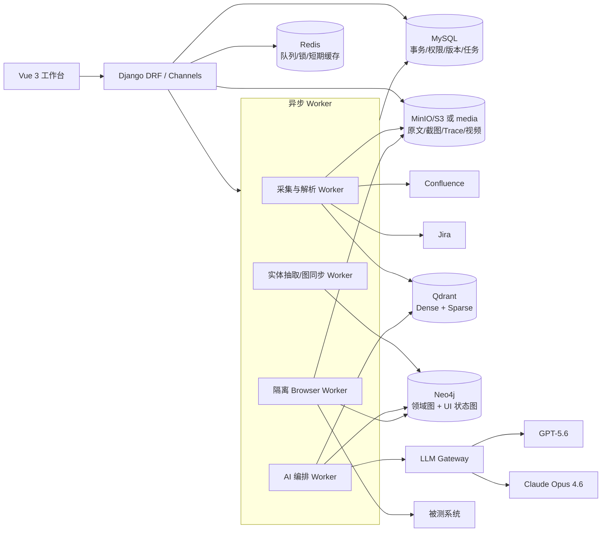
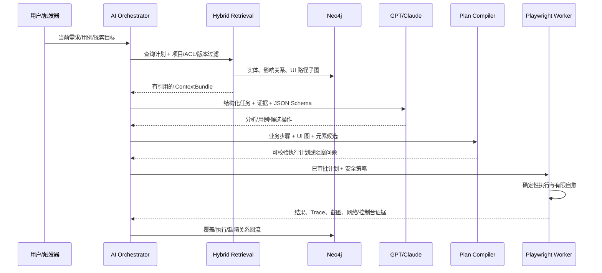
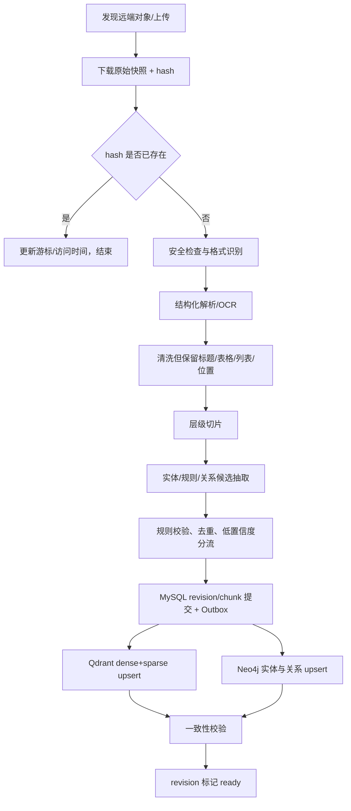
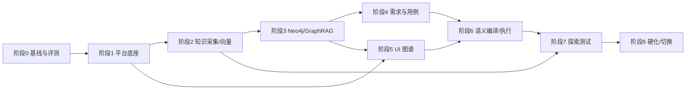

# TestHub AI 智能测试平台完整设计方案（单一事实源）

> 文档性质：产品需求、总体设计、详细设计、实施计划、验收标准和 AI 开发上下文协议的单一事实源（SSOT）  
> 文档版本：1.6.1  
> 基线日期：2026-07-17  
> 适用仓库：TestHub（Django 4.2 + Vue 3 + Playwright）  
> 当前状态：M0 基线就绪（WP-000/WP-002/WP-001 已完成）；下一工作包为 WP-101 新 app 与配置骨架  
> 维护规则：任何实现若与本文冲突，必须先修改本文并记录决策，再修改代码；聊天记录、临时提示词和口头约定不能覆盖本文。

---

## 0. 如何使用本文

本文不是概念性建议，而是后续开发的执行基线。第一次参与本项目的人或 AI 必须完整阅读全文；后续会话在已有实施记录基础上至少重读核心治理章节和本工作包相关章节。每个开发会话都必须先执行以下启动协议：

本项目同时维护一个短小的可变检查点文件 `docs/AI_IMPLEMENTATION_STATE.md`。本文仍是唯一规范性设计 SSOT；状态文件只记录 active WP、已验证事实、blocker、测试和下一步，不能覆盖本文。电脑关机、进程退出、对话过长发生上下文压缩或开启新对话时，必须先读取状态文件，再按其 `design_version` 读取本文。

1. 完整读取 `docs/AI_IMPLEMENTATION_STATE.md`；重读本文的第 0、1、2、3、14、18、19、20 节及当前工作包引用章节；首次参与者必须读本文全文。
2. 在“第 20 节实施台账”中找到唯一一个 `IN_PROGRESS` 工作包；若没有，则按依赖顺序选择下一个 `READY` 工作包。
3. 阅读工作包涉及的接口契约、数据模型、测试和验收标准，不得只根据工作包标题猜测实现。
4. 开发前记录本次变更的工作包 ID、目标、输入、影响文件和验证命令。
5. 开发完成、准备关机、长任务暂停或上下文可能压缩前，先更新状态文件，再同步本文第 20.5 节的工作包状态、验证证据、设计偏差和未决问题。没有测试证据不得标记 `DONE`。
6. 新需求先进入“第 21 节变更控制”，完成影响分析和架构决策记录（ADR），再进入代码。

为了避免上下文丢失，运行时 AI 同样不得依赖聊天历史作为唯一记忆。每次分析、生成、编译、执行和探索都必须持久化 `Run`、`ContextBundle`、`RetrievalTrace`、输入/输出版本、模型/提示词/Schema 版本和证据引用；任何阶段均可从持久化检查点恢复。

### 0.1 规范词

- “必须”：功能正确性、安全性或可恢复性的硬约束。
- “应该”：默认执行，只有记录 ADR 后才能偏离。
- “可以”：可选增强，不影响基线验收。
- “来源证据”：可以回溯到原文版本、段落/表格/评论、URL 和时间的内容。
- “有界全路径”：在明确的环境、账户、入口、操作白名单、深度、数据和时间预算内，对已发现状态的可执行动作完成遍历；不声称覆盖无限动态系统的所有理论路径。

### 0.2 文档内关键标识

- `DEC-*`：已经确定的架构决策。
- `FR-*`：功能需求。
- `NFR-*`：非功能需求。
- `WP-*`：实施工作包。
- `AC-*`：验收标准。
- `OPEN-*`：需要用户确认但已有默认值、不会阻塞本文设计的参数。

---

## 1. 目标、范围与成功标准

### 1.1 产品目标

在现有 TestHub 中建设一个可追溯、可恢复、可评估的 AI 智能测试闭环：

```text
多源需求/用例/Bug
        ↓
版本化知识库 + 领域知识图谱
        ↓
需求理解、关联功能检索、覆盖分析
        ↓
可追溯测试用例
        ↓
被测系统状态/路径图谱
        ↓
结构化执行计划 → Playwright 确定性执行
        ↓
结果、证据、缺陷、覆盖反馈
        ↓
风险驱动探索测试与知识回流
```

### 1.2 对原始五项需求的正式化

| ID | 正式需求 | 交付结果 |
|---|---|---|
| FR-1 | 支持手动上传、Confluence、Jira 等来源的增量采集，构建带版本、权限和证据的知识库/知识图谱 | 数据源管理、同步任务、文档解析、混合向量索引、Neo4j 领域图谱、搜索与证据页 |
| FR-2 | AI 分析当前需求，从知识库与图谱检索关联功能、历史需求、用例、Bug、规则和流程，生成并评审测试用例 | 需求工作台、GraphRAG 检索、覆盖矩阵、结构化用例、隔离审查、人工采纳 |
| FR-3 | 用 Playwright 探索被测 Web 系统，形成节点—边状态逻辑图，执行有界全路径遍历并存入 Neo4j | 爬取配置、登录会话、安全策略、状态指纹、前沿队列、图谱可视化、覆盖与恢复 |
| FR-4 | 根据测试用例，联合语义/向量/图谱/UI 路径检索，把业务步骤编译成可校验的浏览器操作并自动执行 | 测试意图 IR、元素绑定、路径规划、执行计划、Playwright Worker、自愈建议、证据报告 |
| FR-5 | 根据知识、风险和未覆盖图谱开展探索测试，形成可重放发现 | 探索任务书、覆盖引导策略、自动预言机、缺陷去重、最小复现、Jira 草稿/回流 |

### 1.3 明确不做或不承诺的内容

1. 不承诺对任意动态 Web 系统进行数学意义上的“所有路径”遍历。循环、无限数据、时间相关状态、权限组合和第三方页面使其不可判定。系统交付的是可配置、可度量、可恢复的“有界全路径”。
2. 不让 LLM 在生产环境中直接执行任意代码、任意 Cypher、任意网络请求或无审批的破坏性操作。
3. 不把向量相似度当作事实正确性；任何生成结论必须有证据、规则校验或明确标为假设。
4. 不自动修改失败用例的预期结果来让执行通过。
5. 第一阶段只覆盖 Web UI。APP 自动化和 API 自动化可复用知识与编排层，但不在本期自动探索主链路中。
6. 不一次性重写现有 `requirement_analysis` 和 `ui_automation`。采用兼容接口、适配器和可回滚迁移。

### 1.4 产品级成功标准

- 任一生成用例都能追溯到需求/规则/Bug/页面路径的具体版本和证据片段。
- 同一输入、知识快照、模型/提示词版本和随机参数能够重放；模型非确定性差异有记录。
- 需求变更后，能计算受影响功能、用例、UI 路径和历史缺陷，不做全库盲目重生成。
- 浏览器执行失败时，能区分产品缺陷、定位失效、环境故障、测试数据问题和模型规划问题。
- 探索发现只有经过确定性重放和证据校验后才成为正式缺陷候选。
- 任何长任务都能暂停、取消、超时、重试、续跑，且不会因重复投递产生重复数据。

---

## 2. 仓库现状与演进策略

### 2.1 已有能力

当前仓库已经包含：

- Django 4.2、DRF、Celery、Redis、Channels；主业务数据库为 MySQL。
- Vue 3、Vite、Element Plus、Pinia。
- `apps.requirement_analysis`：文档上传/解析、需求分析、AI 用例生成、多模型配置。
- `apps.ui_automation`：Playwright/Selenium 执行、元素库、用例/套件/记录、Browser Use AI 模式。
- `UIPageGraph`、`UIPageNode`、`UIPageElement`、`UIPageEdge` 及约 6000 行的页面图谱爬取服务，已有状态去重、队列、覆盖度、暂停/恢复、路径规划和 AI 用例上下文。
- AI 用例生成 Skill、模块路由、外部 MCP 上下文和用例 JSON 修复/校验逻辑。

现有能力是本方案的迁移起点，但目前主要缺口是：

- 缺少 Confluence/Jira 增量同步、来源 ACL、内容版本、删除传播和统一知识生命周期。
- 页面/需求检索主要依赖关键词和大段 prompt 拼接，缺少标准化混合检索、重排与检索评估。
- 缺少 Neo4j 领域图谱和 UI 图谱主存储，关系库承担了不适合的图遍历职责。
- 缺少贯通“来源→事实→需求→用例→执行→缺陷”的稳定 ID、证据链和变更影响分析。
- LLM 调用、上下文、提示词、输出 Schema、成本和可恢复状态尚未统一治理。
- 现有 `apps/ui_automation/views.py` 和 `page_graph_service.py` 体积过大，新增逻辑必须模块化，不能继续集中堆叠。

### 2.2 演进原则

- `DEC-001`：保留 MySQL 为业务事务与控制面的事实源；不把用户、权限、任务状态和审批迁到 Neo4j。
- `DEC-002`：Neo4j 成为领域关系图和 UI 状态路径图的主查询存储；通过事务 Outbox 同步，不做请求内 MySQL + Neo4j 双写。
- `DEC-003`：Qdrant 成为知识片段的密集 + 稀疏混合向量存储；MySQL 仅保存片段元数据/状态，Neo4j 保存实体关系，不把三类负载强塞进同一数据库。
- `DEC-004`：沿用 Python Playwright 异步库作为主执行引擎。Playwright CLI 只用于安装浏览器、诊断和人工 codegen，不作为服务端编排协议。
- `DEC-005`：LLM 负责理解、候选生成、审查和受限修复；图算法、权限、去重、Schema 校验、路径执行、断言和安全策略由确定性代码完成。
- `DEC-006`：所有新外部 ID 使用 UUIDv7；兼容现有自增 ID，并通过 `legacy_ref`/`external_ref` 映射。
- `DEC-007`：先建立离线评测集再决定模型路由。当前基线所有生成、审查、规划和探索角色都使用公司内部 GPT-5.6；审查必须使用独立上下文/提示词/Run，Claude Opus 4.6 仅作为以后可选的异构 challenger/A-B，不是交付依赖。
- `DEC-008`：GraphRAG 采用“显式领域本体 + 本地子图检索 + 可选社区摘要”，不直接用 LLM 对全量文本自由生成不可治理的图。
- `DEC-009`：dense embedding 默认复用本机 Ollama `qwen3-embedding:0.6b`（已验证 1024 维）；精确词项使用独立 `lexical-v1` sparse encoder，相关性精排使用独立 reranker，三者不能混为一个模型能力。
- `DEC-010`：容量按大型知识库设计，初始支持至少 1 万条测试用例并为 10 万～100 万 chunk 留出分片、磁盘向量、批处理和重建能力，不以内存一次加载全库。
- `DEC-011`：被测环境是用户独占、允许全量测试写操作，但模型仍不能绕过动作策略；对外邮件、短信、Webhook、支付等环境外副作用必须单独 allowlist。
- `DEC-012`：首批知识源严格限定 Jira `PIMC` 与 Confluence `P331` 根页面 `66978175`；默认空白名单，禁止因 PAT 可访问 385 个项目而全量采集。
- `DEC-013`：Jira PIMC 使用有效许可的 SynapseRT/Go2Group Synapse 测试管理插件，新增独立只读 `SynapseRTAdapter` 采集套件、步骤、计划、周期、运行、需求/缺陷关系；不得调用插件的写入、执行或 AI 生成 endpoint。
- `DEC-014`（已被 DEC-015 取代）：原约定为仅使用 SVN，不双重提交同一工作包。
- `DEC-015`：SVN 是权威主线，Git 是同步镜像；`.env` 必须同时由 `svn:ignore` 和 `.gitignore` 排除。每个工作包先进行路径级 SVN 提交，再以相同 WP ID 进行路径级 Git 提交并记录 revision/hash；禁止全工作树暂存或夹带用户已有改动，任一侧失败必须记录 divergence 并恢复同步。

### 2.3 与现有模型的兼容

| 现有能力 | 处理方式 |
|---|---|
| `RequirementDocument` | 保留 API；上传后创建/关联新的 `KnowledgeArtifact` 和 `ArtifactRevision` |
| `BusinessRequirement` | 作为业务展示模型保留；增加稳定 `uid`、版本、证据、图谱同步字段或建立一对一映射 |
| `GeneratedTestCase` / `TestCase` | 保留采纳流程；新增不可变 `TestCaseVersion` 和证据/覆盖关联 |
| `AIModelConfig` | 迁移为统一 LLM Gateway 配置的兼容视图；API Key 改为加密引用 |
| SQL 页面图四表 | 迁移期双读校验；控制面继续保留 `UIPageGraph`，节点/边通过 Outbox 写 Neo4j，切换后 SQL 明细只读或归档 |
| 现有页面图爬取 | 拆为 `crawl/` 子包并复用成熟逻辑，补充 Neo4j、状态指纹 v2、隔离回放、安全和可观测性 |
| 现有 AI 用例 Skill/MCP | 作为检索源之一，不再把大段内容无差别塞入 prompt；统一进入 `ContextBundle` |
| Selenium | 作为遗留执行器保留，但新智能编译、自愈和探索只保证 Playwright |

---

## 3. 总体架构与技术栈

### 3.1 逻辑架构



### 3.2 运行时闭环



### 3.3 推荐技术栈

| 层 | 默认技术 | 选择原因 | 备选/限制 |
|---|---|---|---|
| Web/API | 现有 Django 4.2 + DRF + Channels | 最大化复用权限、项目、用例和前端接口 | 后期可升级 Django，但不作为本项目先决条件 |
| 异步任务 | Celery + Redis，按 `ingestion/ai/graph/browser` 分队列 | 已有依赖；支持重试、隔离并发和任务路由 | Browser 长任务必须独立 Worker，不能占用 API 进程 |
| 事务数据 | MySQL 8 | 现有主库，适合审批、状态、配置 | 不承担向量相似检索和深图遍历 |
| 对象存储 | 开发期现有 `media`；生产 MinIO/S3 | 原文、附件、DOM、截图、视频、Trace 体积大 | 数据库只保存 URI、hash、类型、大小 |
| 向量/稀疏检索 | Qdrant（named dense + sparse vectors） | 与 MySQL 解耦，payload ACL 过滤，适合混合检索 | 小规模 PoC 可用 Neo4j vector index，但不是生产基线 |
| 知识/UI 图谱 | 用户已部署的 Neo4j 5.x | 属性图、路径规划、影响分析、图可视化成熟 | 所有查询必须参数化并经过项目/ACL 约束 |
| 文档解析 | Docling 为主；`pypdf`、`python-docx`、BeautifulSoup/lxml 为兜底 | 保留标题、表格、列表和页码等结构 | 扫描件增加 PaddleOCR；失败原文进入人工处理队列 |
| Confluence/Jira | Atlassian REST API v2/v3 适配器；OAuth/PAT/Basic 由部署类型决定 | 支持版本、评论、附件、JQL/CQL 和增量游标 | Cloud 与 Data Center 差异由连接器封装 |
| Embedding | 默认复用本机 Ollama `qwen3-embedding:0.6b`，实际验证输出 dense 1024；lexical sparse 由独立确定性编码器生成 | 已部署、中文/英文可用、595.78M Q8_0，避免新增 dense 推理服务 | 用黄金集与本机 `qwen3-embedding:latest`/BGE-M3 A/B；切换模型必须新 collection |
| Reranker | `BAAI/bge-reranker-v2-m3` 独立服务 | 用较小成本提高 top-k 精度 | 超时降级到 RRF，不阻塞主流程 |
| LLM | 默认公司内部 GPT-5.6，经统一 Gateway；Claude Opus 4.6 可选 | 同一 GPT 按角色隔离上下文/提示词/Run，结构化输出并可替换 | 实际 API 型号/上下文上限从配置读取；不依赖 Claude 才能验收 |
| 浏览器 | Playwright Python async API + Chromium 为基线 | 与现有 Python服务兼容；自动等待、Trace、网络/控制台事件完善 | Firefox/WebKit 用于兼容性矩阵；Browser Use 仅用于隔离探索候选 |
| Schema | Pydantic 2 + JSON Schema | LLM 输出与 API/持久化共用契约 | Schema 版本必须随 Run 保存 |
| 观测 | OpenTelemetry + Prometheus/Grafana + 结构化日志 | 贯通 API、Celery、LLM、检索和浏览器执行 | 初期至少实现 trace_id、run_id、指标导出 |
| 密钥 | 生产 Vault/KMS；开发期 Fernet 加密字段 + 外部 master key | 禁止 API Key、Jira Token、密码和 storage state 明文入库/日志 | `.env` 只保存密钥引用或开发 master key，不提交仓库 |

### 3.4 为什么不能只用 GPT/Claude 组建知识库

GPT-5.6 和 Claude Opus 4.6 是推理/生成模型，不应承担每个片段的长期向量索引工作。正确分工是：

- 专用 embedding 模型完成高吞吐、稳定、可重建的向量化；本项目默认使用已验证的 Ollama `qwen3-embedding:0.6b`。
- 确定性解析器保留原文结构和版本。
- GPT-5.6 从证据中抽取标准化实体、规则和关系，生成测试设计。
- GPT-5.6 reviewer 以隔离的审查提示词和只读候选上下文检查遗漏、矛盾、不可执行步骤和探索风险；可选 Claude challenger 用于评测多样性，不改变硬校验优先级。
- Qwen3 Embedding 只产生 dense vector；Jira key、字段名、精确错误文本和中文词项仍由版本化 lexical sparse encoder 召回，相关性精排仍由独立 reranker 完成。
- 只有低置信度的实体合并、矛盾裁决和复杂跨文档关系才调用强 LLM；普通更新走 hash、规则和 embedding。

### 3.5 模型角色默认路由

| 角色 | 默认模型 | 温度建议 | 输出方式 | 降级 |
|---|---|---:|---|---|
| query_planner | GPT-5.6 | 0.0 | JSON Schema | 规则分词 + 原查询 |
| knowledge_extractor | GPT-5.6 | 0.0 | JSON Schema，分片执行 | 保存片段并标记待抽取 |
| requirement_analyst | GPT-5.6 | 0.1 | JSON Schema + 引用 | 阻塞生成，不输出无证据事实 |
| testcase_designer | GPT-5.6 | 0.2 | `TestCaseSet v1` | 可切换 Claude 进行 A/B |
| testcase_reviewer | GPT-5.6（独立 reviewer Run） | 0.0 | `ReviewReport v1` | 可选 Claude challenger；确定性 validator 始终执行 |
| execution_planner | GPT-5.6 | 0.0 | `TestIntentIR v1` | 规则编译可明确映射的步骤 |
| runtime_repair | GPT-5.6（按需视觉） | 0.0 | 候选列表，不能直接操作 | 确定性定位器降级后阻塞 |
| exploration_charter | GPT-5.6 | 0.2 | `ExplorationCharter v1` | 规则模板生成最小 Charter |
| finding_triage | GPT-5.6 | 0.0 | 分类/解释，最终由规则和重放确认 | 规则签名去重 |

模型路由必须由评测结果驱动。任一型号升级先在黄金集影子运行，比较检索引用正确率、Schema 合法率、用例覆盖、执行成功和成本，达到第 17 节门槛后才能切换默认别名。

当前仓库实测状态：`writer` 和 `reviewer` 都配置为公司内部 `gpt-5.6-sol`。该配置即为正式基线，不再把 Claude 作为 M2 验收前置。为了减少同模型自我认同，reviewer 不读取 generator 的思考过程，只读取同一固化证据、候选用例和审查 rubric；使用独立 PromptVersion、低温度、独立 AIRun，并由引用/Schema/覆盖/安全 validator 作最终硬门槛。未来增加 Claude 只能作为 challenger 提升多样性，不能替代这些约束。

---

## 4. 统一领域模型与标识体系

### 4.1 三类存储的职责边界

| 数据 | MySQL | Qdrant | Neo4j | 对象存储 |
|---|---:|---:|---:|---:|
| 用户、项目、权限、审批 | 主存 | 否 | 仅投影 `project_id` | 否 |
| 数据源配置、同步游标、任务状态 | 主存 | 否 | 否 | 否 |
| 原始文件、附件、截图、Trace | 元数据 | 否 | URI/摘要 | 主存 |
| 文档版本、片段元数据 | 主存 | 检索副本 | 文档/段落实体投影 | 正文快照 |
| dense/sparse vector | 否 | 主存，可重建 | 否 | 否 |
| 需求、规则、功能、流程关系 | 业务映射/版本 | 文本检索 | 图查询主存 | 证据快照 |
| UI 页面状态、元素、动作边 | 爬取控制/摘要 | 语义文本索引 | 图查询主存 | DOM/截图 |
| 用例/执行/发现 | 主业务记录 | 可检索摘要 | 可追溯投影 | 执行证据 |

Qdrant 和 Neo4j 都是可由 MySQL 元数据 + 对象存储原文重建的派生存储；MySQL 业务记录和原始证据不可因重建而改变。

### 4.2 稳定 ID 与版本规则

- 新聚合根 ID：UUIDv7 字符串，字段统一命名为 `uid`。
- 来源对象业务键：`source_uid + external_id`，例如 Confluence page ID、Jira issue key。
- 每次内容变更创建不可变 `revision_uid`；`content_hash` 相同则跳过解析、抽取和向量化。
- 片段 ID：`sha256(revision_uid + structural_path + normalized_text)`，同一版本可幂等重建。
- 图节点 `uid` 不因标题变化而变化；无法确定同一实体时新建候选，不做破坏性合并。
- 所有引用使用 `uid + version`，禁止仅以可变名称关联。
- 时间使用 UTC 存储，API 按 `Asia/Shanghai` 展示。

### 4.3 MySQL 新增核心模型

以下是逻辑模型；实现时按仓库规范拆分 migration，不要求单个 migration 一次创建全部表。

| 模型 | 核心字段 | 说明 |
|---|---|---|
| `KnowledgeSource` | `uid, project_id, type, name, base_url, auth_ref, scope_config, sync_policy, status` | `upload/confluence/jira/mcp` 数据源 |
| `SourceSyncCursor` | `source_uid, cursor, last_remote_updated_at, last_success_at, etag` | 增量同步游标 |
| `KnowledgeArtifact` | `uid, source_uid, external_id, artifact_type, title, canonical_url, acl, status` | 文档、页面、Issue、用例、Bug 的逻辑对象 |
| `ArtifactRevision` | `uid, artifact_uid, version, content_hash, raw_uri, parsed_uri, parser_version, remote_updated_at, is_current` | 不可变内容版本 |
| `KnowledgeChunk` | `uid, revision_uid, parent_uid, structural_path, text, token_count, page_no, qdrant_point_id, metadata` | 可回溯文本位置 |
| `IngestionJob` | `uid, source_uid, job_type, status, checkpoint, stats, error, started_at, completed_at` | 可重试、可续跑任务 |
| `ExtractionReviewItem` | `uid, revision_uid, candidate_type, candidate_json, confidence, status, reviewer_id` | 低置信度实体/冲突人工队列 |
| `ProjectionOutboxEvent` | `uid, target, aggregate_type, aggregate_uid, event_type, schema_version, payload, status, attempts, next_retry_at` | MySQL 提交后异步写 Neo4j/Qdrant/对象派生索引；一个目标一条事件 |
| `AIRun` | `uid, project_id, run_type, objective, status, checkpoint, model_route, input_hash, parent_run_uid` | 所有 AI 工作流的统一运行记录 |
| `ContextBundle` | `uid, run_uid, bundle_type, query_plan, snapshot_ids, token_count, content_uri, content_hash` | 固化实际提供给模型的上下文 |
| `RetrievalTrace` | `uid, run_uid, query, filters, candidate_ids, ranks, scores, selected_ids, latency` | 可解释、可离线评估的检索轨迹 |
| `PromptVersion` | `uid, role, name, semantic_version, template_hash, schema_version, status` | 提示词版本；激活需评测 |
| `TestCaseVersion` | `uid, testcase_id, version, structured_body, evidence_refs, coverage_refs, status` | 采纳后不可变版本 |
| `ExecutionPlan` | `uid, testcase_version_uid, plan_version, graph_snapshot_uid, body, binding_score, approval_status` | 编译后的确定性计划 |
| `BrowserRun` | `uid, plan_uid/crawl_uid, worker_id, status, environment_snapshot, artifact_manifest` | 浏览器运行与证据清单 |
| `ExplorationCampaign` | `uid, project_id, charter, budget, safety_profile, status, checkpoint` | 探索任务 |
| `Finding` | `uid, campaign_uid, signature, severity, title, evidence, replay_status, jira_key` | 探索发现/缺陷候选 |

### 4.4 项目映射

仓库中通用 `Project` 与 UI 自动化 `UiProject` 是两个边界。第一阶段新增 `ProjectResourceBinding`：

```text
ProjectResourceBinding
- uid
- project_id                 # 通用项目
- resource_type              # ui_project / api_project / app_project
- resource_id
- environment                # test/staging/preprod
- is_default
- created_at / updated_at
UNIQUE(project_id, resource_type, resource_id, environment)
```

所有知识、图谱和 AI Run 以通用 `project_id` 做租户边界；需要操作 UI 时通过 binding 找到 `UiProject`。在完成迁移前，不直接合并两个已有项目表。

### 4.5 证据引用格式

所有分析、用例、图关系和缺陷使用统一引用对象：

```json
{
  "artifact_uid": "uuidv7",
  "revision_uid": "uuidv7",
  "chunk_uid": "sha256-id",
  "source_type": "confluence",
  "external_id": "123456",
  "title": "订单退款需求",
  "canonical_url": "https://...",
  "structural_path": "3.2/验收标准/表格[2]/行[4]",
  "quote": "退款金额不得大于可退金额",
  "remote_updated_at": "2026-07-15T03:20:10Z"
}
```

`quote` 只存必要短句；完整上下文通过 `chunk_uid` 获取。页面显示引用时必须校验用户仍有来源权限。

---

## 5. 知识库采集、解析与索引

### 5.1 数据源与认证

#### 手动上传

支持 `pdf/docx/xlsx/csv/txt/md/html/json/yaml/png/jpg`，单文件大小、页数和压缩包层级可配置。上传后计算 MIME、SHA-256，做扩展名/MIME 一致性检查、病毒扫描（生产推荐 ClamAV）和重复检测。压缩包不得包含路径穿越、符号链接或超限展开内容。

#### 公司门户 SSO 引导

当前 Confluence/Jira 均部署在公司服务器并由公司门户登录后跳转。连接器优先争取 REST API 专用 PAT/服务账户，因为它更稳定、可审计、适合增量同步。2026-07-16 实测门户只监听 HTTP，443 端口拒绝连接，页面 `isSecureContext=false`，认证公钥、client-info 等 API 也全部走 HTTP；因此默认安全策略禁止自动提交真实密码。若公司提供 HTTPS 反向代理或批准的安全入口，才启用 `PortalSSOAuthBootstrap`：

1. 使用受控 Playwright context 打开门户，按 `SecretRef` 注入账号密码并完成跳转。
2. 只保存 Confluence/Jira 目标域所需的加密 cookie/session，记录过期时间；门户密码不写文档、普通配置、日志或截图。
3. 用该 session 调用最小只读 REST endpoint，验证它是否同时授权 API；若仅网页可用，则通过同会话请求 REST，而不是用浏览器 DOM 批量抓页面。
4. session 失效进入 `WAITING_FOR_USER_AUTH`/自动重新引导；遇到 MFA、验证码或新增授权不得绕过，暂停等待用户。
5. 连接器的 allowed origins 固定为门户、Confluence、Jira 的明确域名，阻止 SSO 重定向到未知域。

门户账号密码只在实际联调时由用户放入本地 secret/环境变量或未来的数据源凭证页面，不提交仓库。本设计文档只记录认证模式，不记录秘密。当前可选的安全解法按优先级为：Confluence/Jira PAT/服务账户；公司为门户提供 HTTPS；用户在本地 headed browser 手工登录并只导出目标产品域的加密 session；最后才是在公司安全负责人明确接受风险并记录 ADR 后启用 `allow_insecure_portal_login`，该开关不得成为平台默认值。

只读探测还发现未认证的门户 `/api/eip-auth/client-info` 响应包含非空 `clientSecret` 字段且通过 HTTP 返回。平台不得使用、记录或传播该值；应由用户报告门户维护方检查是否属于敏感配置泄露。该发现不授权进一步安全测试。

#### Confluence

- 当前目标按公司自建 Server/Data Center 兼容模式设计；支持 PAT/Basic/门户 SSO session，由连接器能力探测决定，Cloud adapter 仍保持接口兼容但不是当前联调目标。
- 范围可配置 space、父页面、label、CQL、附件类型、是否包含评论/历史版本。
- 首次全量，后续按 `lastModified` + page version 增量；Webhook 作为加速，轮询作为最终一致性兜底。
- 保存页面 ID、space key、版本号、父子结构、作者、更新时间、URL、正文 storage format/ADF 转换结果、附件和来源 ACL。
- 只采集配置范围内内容；远端无权限/删除时标记 tombstone，并异步删除当前向量、撤销 current 图投影，历史 revision 仍按保留策略审计。

#### Jira

- 使用 JQL 限定 project、issueType、status、label、时间和自定义字段。
- PAT 实测账户可访问 385 个 Jira 项目，因此 source 创建后默认 `selected_project_keys=[]`、不得同步任何项目；只有用户明确选择的 Project Key/JQL 才进入发现队列。禁止把“账号可访问”解释为“全部获准采集”。
- 采集 Requirement/Story/Task/Test/Bug/Epic 及描述、验收标准、自定义字段、评论、附件、issue links、sub-task、sprint/fixVersion/component。
- ADF 转为结构化 Markdown，同时保存 raw JSON。
- 增量基于 `updated` 游标 + issue changelog；Webhook 加速，定期 reconciliation 防漏。
- Jira Test/Xray/Zephyr 等插件通过独立 adapter 解析，不能把插件特有字段写死到通用 connector。
- Jira 浏览器登录可经公司门户 SSO，但知识采集不依赖 HTTP 门户；已确认目标为 `https://jira.dms365.com` 11.3.6，连接器直接使用 HTTPS REST API 与 PAT。
- 当前已确认 Jira `11.3.6`，HTTPS/HSTS 正常，`/rest/api/2/*` 未认证时返回 401，采用 Data Center REST v2 连接器；门户凭证在 Jira 本地 HTTPS 登录仅验证一次并返回凭证错误，不再重试。用户提供的 Cryptacular、Trove4j、JGraphT、JFreeChart 等是 Jira 产品依赖/许可证清单，不是 Xray、Zephyr 等测试管理插件清单。
- PAT 只读探测已成功：身份、Server Info、项目、Issue Type 和字段元数据均返回 200；发现 23 种 Issue Type，其中包含自定义 `测试用例`、`测试计划`、`需求`、`缺陷` 等，字段共 174 个。连接器必须按项目读取 create/edit metadata 和样本 Schema 后再建立映射，不用名称猜字段结构。
- 首批 Jira 白名单仅为 `PIMC`。只读 JQL 基线：总计 52,205；测试用例 24,678（Issue Type ID 10201）、测试计划 37（10202）、需求 1,625（10200）、缺陷 24,193（10203）、任务 847、技术预研 65、分解任务 760。连接器保存 Issue Type ID，查询使用 ID/项目级 metadata，避免中文名称、重命名或 PowerShell 编码导致 JQL 失效。
- 用户指定的首批 Jira 页面入口是 `/projects/PIMC/issues/` 和 SynapseRT 的 PIMC 测试套件树页面；它们只用于范围确认和人工导航。正式采集必须使用 `project = PIMC` 的 REST/JQL、分页游标及只读 SynapseRT endpoint allowlist，不通过 DOM 爬取 Jira 页面正文，也不得扩展到 PAT 可访问的其他项目。
- PIMC 已安装有效许可的 SynapseRT（模块 namespace `com.go2group.jira.plugin.synapse`，REST 基址 `/rest/synapse/latest/`）。新增 `SynapseRTAdapter`，在契约探测后只允许读取：测试套件树/成员、测试步骤、测试计划成员、测试周期/运行、需求—用例、运行—缺陷等关系。静态资源中发现的 `add/update/delete/clone/trigger/generateAI` 等 endpoint 一律不进入 ingestion allowlist。
- Jira 11.3.6 的旧 `createmeta?projectKeys=...` 返回 404；使用 `/rest/api/2/issue/createmeta/{projectKey}/issuetypes` 与按 Issue Type 分页的新版 metadata endpoint。版本升级前后均由 adapter capability probe 选择，不写死单一 API。
- 当前已确认 Confluence `10.2.7`；最初提供的是门户 client link，随后已补充并验证实际 HTTPS base URL。
- Confluence 实际 base URL 已确认 `https://conf.dms365.com`；PAT 身份、Space 和 Content 分页接口均返回 200。与 Jira 相同，source 默认不采集任何 Space，必须选择 Space Key/父页面/CQL 白名单。
- 首批 Confluence 白名单仅为 Space `P331`、根页面 ID `66978175`（当前探测版本 144）。`child/page`、附件、评论和 restriction 接口可用；`descendant/page` 在当前服务返回 500，因此递归采集必须以 `child/page` 分页 BFS 实现，队列/游标写 checkpoint，不能依赖一次递归 endpoint。

#### MCP

现有外部 MCP 服务器可作为在线补充知识源，但不默认成为持久知识事实。只有配置 `persist_results=true` 且结果具备稳定 ID/版本/ACL 时，才进入正式 ingestion；否则只记录到本次 `ContextBundle`。

### 5.2 标准采集流水线



每一步输入/输出带版本和 hash。任务重试从 checkpoint 继续；同一 `revision_uid + stage` 使用幂等键，重复 Celery 投递不得创建重复 revision、point 或 graph node。

### 5.3 解析与清洗规则

1. 原始快照永不原地修改；解析产物包含 `parser_name/version`。
2. 保留标题层级、段落、列表、表格行列、代码块、链接、图片说明、页码/工作表/单元格范围。
3. 页眉页脚、重复导航、空白可清理，但必须记录清洗规则版本。
4. 表格按“表头 + 一行/一个逻辑块”切片；测试步骤表不得拆散步骤号、动作和预期。
5. 图片先 OCR，再由配置决定是否调用视觉模型生成说明；OCR/说明标明 `derived=true`，不能伪装成原文。
6. Jira 评论独立成 chunk 并关联作者/时间，避免新评论覆盖 Issue 主描述语义。
7. 密码、Token、身份证、手机号等按项目策略脱敏；原文访问受更高权限控制。
8. 文档内提示注入（如“忽略以前指令”）作为普通不可信文本保存，不得改变系统提示词或工具权限。

### 5.4 层级切片

默认参数（均可项目级覆盖）：

- 目标 400–800 tokens，硬上限 1200 tokens，重叠 80 tokens。
- 标题路径和父级摘要不计入原文位置，但随向量 payload 提供。
- 验收标准、业务规则、状态转换、决策表、单条测试用例优先作为语义完整块，即使略小。
- 过长章节先按子标题/列表/表格切；仍过长再按句子切，不按固定字符硬截。
- 为每个叶子 chunk 生成 80–150 tokens 的 parent summary 只用于检索，不作为事实引用。

### 5.5 Qdrant collection

默认 collection：`testhub_knowledge_v1`。

```yaml
vectors:
  dense:
    size: 1024
    distance: Cosine
sparse_vectors:
  lexical: {}
payload_indexes:
  - project_id: keyword
  - artifact_type: keyword
  - source_type: keyword
  - artifact_uid: keyword
  - revision_uid: keyword
  - is_current: bool
  - acl_principal_ids: keyword
  - language: keyword
  - remote_updated_at: datetime
```

point payload 至少包含：`chunk_uid, project_id, artifact_uid, revision_uid, title, structural_path, text, source_type, artifact_type, is_current, acl_principal_ids, graph_entity_uids, content_hash, embedding_model_version, sparse_encoder_version`。

当前向量编码规定：

- `dense`：通过 Ollama `/api/embed` 调用 `qwen3-embedding:0.6b`；本机已验证模型为 595.78M、Q8_0、输出 1024 维。文档向量使用原始结构化文本，查询向量可增加版本化 retrieval instruction；是否增加 instruction 由黄金集决定。
- `lexical`：`lexical-v1` 确定性 sparse encoder，保留 Jira key、用例编号、URL/字段名/错误码等精确 token；中文使用词切分 + CJK bigram，英文/数字/标识符规范化，token 通过稳定 hash 映射 sparse index，权重使用版本化 BM25/IDF 策略。
- `reranker`：仍使用独立服务；Ollama embedding endpoint 不能充当 cross-encoder reranker。未部署时显式降级为 RRF，并在结果中标记。

2026-07-16 本机 smoke：冷启动 2 条文本的模型加载约 9.66 秒；保持加载后 16 条短中文文本成功返回 16×1024 向量，Ollama 报告处理约 1.51 秒（端到端 PowerShell 调用约 3.63 秒）。这证明接口和模型可用，但不代表长文本/全库吞吐；WP-202 必须使用真实 chunk 长度测试 batch 8/16/32、并发、keep-alive、CPU/GPU 占用和全量回填时间。

对至少 1 万条用例按 10 万～100 万 chunk 容量档规划。1024 维 float32 每个 dense vector 原始约 4 KiB；Qdrant 还会产生 HNSW、payload 和 sparse 索引开销。初期测得规模后再决定 on-disk vector、内存映射、分片或 scalar quantization，任何量化都必须先通过检索黄金集，不能只为省内存直接开启。

Embedding 型号、维度、query instruction 或 sparse encoder 发生不兼容变化时创建新 collection，例如 `v2`，后台批量回填、离线评测、别名切换，不在原 collection 混合不同向量空间。Ollama 调用使用批处理、并发上限和 `keep_alive`；初次模型加载延迟与热调用延迟分开监控。

### 5.6 实体抽取输出契约

每个 revision 分片抽取后合并，LLM 只输出候选，确定性服务校验引用和枚举：

```json
{
  "schema_version": "knowledge-extraction/1.0",
  "entities": [
    {
      "temp_id": "e1",
      "type": "Requirement",
      "name": "退款金额校验",
      "description": "退款金额不得超过可退金额",
      "external_keys": ["JIRA:PAY-123"],
      "attributes": {"priority": "high"},
      "evidence_chunk_uids": ["..."],
      "confidence": 0.96
    }
  ],
  "relations": [
    {
      "from_temp_id": "e1",
      "type": "CONSTRAINED_BY",
      "to_temp_id": "e2",
      "evidence_chunk_uids": ["..."],
      "confidence": 0.91
    }
  ],
  "unresolved_mentions": [],
  "contradictions": []
}
```

硬校验：引用 chunk 必须属于当前授权 revision；实体类型和关系类型必须在本体白名单；证据 quote 必须能在标准化原文中找到；置信度不是 LLM 自述值直接采用，而是结合证据存在性、跨分片一致性、外部键、规则和人工反馈校准。

---

## 6. Neo4j 知识图谱与 GraphRAG

### 6.1 双层图模型

同一 Neo4j 数据库中存两个可连接但职责不同的子图：

1. 领域知识图：需求、功能、规则、实体、流程、用例、Bug、版本和执行结果。
2. UI 状态图：应用、环境、页面状态、元素、动作、转换和运行观测。

二者通过 `Feature-[:REALIZED_ON]->PageState`、`TestStep-[:BOUND_TO]->UIElement`、`Requirement-[:COVERED_BY]->TestCase` 等关系连接。所有节点和边必须带 `project_id`；跨项目关系默认禁止。

### 6.2 节点本体

| Label | 作用 | 关键属性 |
|---|---|---|
| `Project` | 租户投影 | `uid, name` |
| `SourceArtifact` | 来源逻辑对象 | `uid, source_type, external_id, title, url, current_revision_uid` |
| `ArtifactRevision` | 不可变来源版本 | `uid, version, content_hash, updated_at` |
| `Section` | 可引用结构块 | `uid, chunk_uid, heading_path` |
| `Requirement` | 可测试需求 | `uid, name, type, priority, status, version` |
| `AcceptanceCriterion` | 验收标准 | `uid, text, normalized_rule` |
| `Feature` | 稳定功能点 | `uid, name, module, status` |
| `BusinessRule` | 约束、计算、权限、决策规则 | `uid, name, expression, rule_type` |
| `DomainEntity` | 业务对象 | `uid, name, aliases` |
| `Workflow` / `BusinessState` | 业务流程与状态 | `uid, name` |
| `TestCase` / `TestCaseVersion` | 用例和版本 | `uid, title, priority, type, version` |
| `TestStep` | 业务测试步骤 | `uid, sequence, action, expected` |
| `TestSuite` / `TestPlan` / `TestCycle` | SynapseRT 套件、计划、执行周期 | `uid, external_id, name, status, version` |
| `TestRun` | 某用例在计划/周期中的运行实例 | `uid, status, assignee_ref, started_at, completed_at` |
| `Bug` | Jira/本地缺陷 | `uid, key, title, severity, status, signature` |
| `Release` / `Component` | 版本/组件 | `uid, name` |
| `Execution` / `Finding` | 执行与探索发现 | `uid, status, started_at, signature` |
| `Application` / `Environment` | 被测应用/环境 | `uid, name, base_url` |
| `UIPage` | 路由/页面模板 | `uid, route_template, name` |
| `PageState` | 可区分的可观察 UI 状态 | `uid, state_hash, url, title, snapshot_version` |
| `UIElement` | 状态内语义元素 | `uid, semantic_name, role, dom_signature` |
| `UIAction` | 动作实体/边的可复用描述 | `uid, action_type, action_key, risk_level` |
| `CrawlSnapshot` | 爬取快照 | `uid, crawl_run_uid, created_at, status` |
| `KnowledgeCommunity` | 全局 GraphRAG 社区摘要 | `uid, level, title, summary, snapshot_uid` |

节点通用属性：`uid, project_id, created_at, updated_at, valid_from, valid_to, is_current, source_revision_uids, evidence_chunk_uids, confidence, extraction_version`。高频大文本和二进制不写 Neo4j，只存对象 URI/摘要。

### 6.3 关系白名单

| 关系 | 例子 |
|---|---|
| `CONTAINS` / `PART_OF` | Artifact→Revision→Section、Feature→子功能 |
| `DERIVED_FROM` | Requirement/Rule/Bug→Section |
| `REFINES` / `IMPLEMENTS` | 子需求→父需求、Feature→Requirement |
| `HAS_CRITERION` / `CONSTRAINED_BY` | Requirement→AcceptanceCriterion/BusinessRule |
| `DEPENDS_ON` / `CONFLICTS_WITH` / `DUPLICATES` | 需求、规则或 Bug 间关系 |
| `AFFECTS` / `REGRESSION_RISK_FOR` | Bug/变更→Feature/Requirement |
| `COVERED_BY` / `VERIFIES` | Requirement/Feature/Rule↔TestCaseVersion |
| `HAS_STEP` / `NEXT_STEP` | TestCaseVersion→TestStep |
| `MEMBER_OF_SUITE` / `IN_PLAN` / `IN_CYCLE` | TestCase/TestRun→SynapseRT 套件、计划和周期 |
| `RUNS_CASE` / `PRODUCED_BUG` | TestRun→TestCaseVersion/Bug |
| `OBSERVED_IN` / `FAILED_AT` | 执行、发现→状态/步骤/元素 |
| `REALIZED_ON` | Feature→UIPage/PageState |
| `INSTANCE_OF` | PageState→UIPage |
| `HAS_ELEMENT` | PageState→UIElement |
| `TRANSITIONS_TO` | PageState→PageState；边属性引用 `action_uid` |
| `BOUND_TO` | TestStep→UIElement/UIAction/PageState |
| `MEMBER_OF` | 实体→KnowledgeCommunity |

所有关系通用属性：`project_id, valid_from, valid_to, is_current, confidence, evidence_chunk_uids, source_revision_uids, created_by_run_uid`。关系证据不足时不创建正式边，放入 `ExtractionReviewItem`。

### 6.4 约束与索引

部署 migration/management command 必须幂等创建以下逻辑约束：

```cypher
CREATE CONSTRAINT entity_uid IF NOT EXISTS
FOR (n:Entity) REQUIRE (n.project_id, n.uid) IS UNIQUE;

CREATE CONSTRAINT page_state_uid IF NOT EXISTS
FOR (n:PageState) REQUIRE (n.project_id, n.uid) IS UNIQUE;

CREATE INDEX page_state_hash IF NOT EXISTS
FOR (n:PageState) ON (n.project_id, n.state_hash);

CREATE INDEX ui_element_signature IF NOT EXISTS
FOR (n:UIElement) ON (n.project_id, n.dom_signature);

CREATE FULLTEXT INDEX knowledge_names IF NOT EXISTS
FOR (n:Requirement|Feature|BusinessRule|Bug|TestCase|UIPage|PageState|UIElement)
ON EACH [n.name, n.title, n.description, n.semantic_name];
```

Neo4j 对多 label 唯一约束的具体语法随版本调整。实现时用基础 `:Entity` label 统一承载 `uid` 约束，领域 label 叠加；management command 必须先读取 Neo4j 版本并验证结果。

### 6.5 实体解析与合并

候选实体按以下顺序匹配：

1. 同项目、同来源 external key 精确匹配。
2. 已确认 alias/业务唯一键匹配。
3. 名称标准化 + 类型 + 关联模块/父实体组合匹配。
4. 向量和图邻域生成候选；reranker + LLM 只做“是否同一实体”的建议。
5. 自动合并阈值默认 `>=0.95` 且无冲突；`0.75–0.95` 人工确认；低于阈值新建实体。

合并是可逆操作：保存 `EntityMergeRecord`、源/目标、原因、证据和操作者。禁止物理删除历史实体；错误合并可拆分并重放图 Outbox。

### 6.6 GraphRAG 模式

#### Local GraphRAG（默认）

适合“当前需求关联哪些功能/用例/Bug/页面”的问题：

1. 混合检索得到 Requirement/Feature/Rule/Bug/UIPage 种子。
2. 只沿关系白名单做 1–3 跳扩展；每类关系有权重、方向和上限。
3. 计算路径分数，过滤过期、无权限、低置信度和无证据节点。
4. 选取最小连通证据子图，连同原文 chunk 组成 `ContextBundle`。
5. LLM 只能对该子图做总结/生成，输出每项结论对应的 node/edge/chunk 引用。

#### Global GraphRAG（按需）

适合“整个项目有哪些高风险域、跨模块共性缺陷”问题：

- 在固定 graph snapshot 上用 Leiden/Louvain 生成社区。
- GPT-5.6 基于社区内有证据节点生成分层摘要；摘要本身带成员和 snapshot 引用，并写入 Qdrant。
- 增量更新只使受影响社区 `stale=true`，后台重算；过期摘要不可用于最终事实断言。
- 不在普通需求生成中默认加载所有社区摘要，防止上下文膨胀。

### 6.7 图查询安全

- LLM 不直接执行自由 Cypher。它输出 `GraphQueryPlan`（种子类型、关系白名单、方向、深度、过滤），服务端模板编译为参数化 Cypher。
- 深度默认 2，最大 4；节点默认 200，硬上限 1000；查询超时默认 3 秒。
- 每个 MATCH 分支带 `project_id`，结果返回前再次做 ACL 交集。
- Neo4j 使用只读查询账户和独立写入账户；API 请求不持有写账户。
- 记录 query template ID、参数 hash、耗时、结果数量，不在日志记录秘密和完整敏感文本。

---

## 7. 混合检索与上下文组装

### 7.1 检索不是一次向量查询

统一 `RetrievalService` 接受自然语言、结构化过滤和调用场景，输出带分数、理由和引用的候选。处理顺序：

1. **Query planning**：识别目标类型、关键实体、项目/版本/状态/时间过滤、是否需要 UI 路径、是否为影响分析。
2. **Query rewrite**：最多生成 3 个互补查询（原始业务表达、同义功能表达、精确 ID/字段表达），保留原查询权重。
3. **并行召回**：Qdrant dense top 60、sparse top 60、MySQL 精确键/标题、Neo4j full-text/实体种子和路径扩展。
4. **融合**：使用 Reciprocal Rank Fusion，默认 `k=60`，同一 chunk 去重。
5. **重排**：reranker 对 top 80 打分，保留 top 20；reranker 超时使用 RRF 顺序并标记 degraded。
6. **图扩展**：从 top 实体扩展白名单关系，计算关联用例/Bug/规则/页面；图扩展结果回查其证据 chunk。
7. **多样性与时效**：每个 revision 最多 3 个 chunk；MMR 默认 `lambda=0.75`；优先 current，但历史对比场景可显式检索旧版本。
8. **Context packing**：按任务预算装入必要原文、最小子图、路径和冲突，不按相似度简单截断。

### 7.2 排名信号

所有分数先在查询内归一化，建议最终分数：

```text
final_score =
  0.30 * reranker_score
+ 0.20 * rrf_score
+ 0.20 * graph_path_score
+ 0.10 * exact_identifier_score
+ 0.10 * authority_and_currentness
+ 0.10 * task_type_prior
```

没有 reranker/graph 信号时按剩余信号归一化，不直接补零惩罚。`authority_and_currentness` 由项目配置，例如已批准需求 > 草稿评论，当前验收标准 > 旧版本，已复现 Bug > 未确认 Finding。排名权重通过黄金集调优，不能凭单次案例改生产值。

### 7.3 关联功能点检索

针对当前需求，必须返回以下分组而非一串无结构文本：

- 直接匹配需求/功能及依据。
- 上下游依赖、共享业务实体和状态流程。
- 约束它的验收标准、业务规则、权限和数据规则。
- 相似/历史版本需求及差异。
- 已覆盖用例和覆盖空白。
- 相关已知 Bug、回归风险、发布/组件。
- 对应 UI 页面/状态/元素/可达路径及图谱新鲜度。
- 矛盾、缺少信息和需人工确认的假设。

每一项包含 `why_related`、关系路径、分数、证据引用、版本/时效；前端允许用户排除错误关联，反馈进入检索评测数据。

### 7.4 ContextBundle

实际发给模型的上下文必须固化为如下逻辑结构：

```json
{
  "schema_version": "context-bundle/1.0",
  "objective": "为 PAY-123 生成回归用例",
  "project_uid": "...",
  "knowledge_snapshot": {"qdrant_alias": "...", "graph_snapshot_uid": "..."},
  "authoritative_facts": [],
  "related_features": [],
  "business_rules": [],
  "historical_cases": [],
  "known_bugs": [],
  "ui_paths": [],
  "conflicts": [],
  "assumptions": [],
  "citations": [],
  "truncation_report": {"omitted_ids": [], "reason": ""}
}
```

上下文预算按优先级分配：硬约束/验收标准 25%，当前需求 20%，关联功能/流程 15%，历史高价值用例 15%，Bug/风险 10%，UI 路径 10%，系统说明与输出 Schema 5%。若内容超限，先摘要重复材料，再减少低分候选；永不截断证据 ID、规则表达式和步骤—预期配对。

### 7.5 检索失败和低证据策略

- 无权威来源：返回 `insufficient_evidence`，允许生成“问题清单/探索建议”，不允许伪造业务规则。
- 来源矛盾：同时呈现冲突版本和时序，阻塞依赖冲突结论的用例，要求人工选择。
- 图谱不可用：降级为向量 + 稀疏检索，Run 标记 `graph_degraded`。
- Qdrant 不可用：可用 MySQL 标题/正文全文兜底做有限查询，但不声称语义召回完整。
- Reranker 超时：保留 RRF，并在检索轨迹记录降级原因。
- 所有降级均必须在 UI 和生成结果中可见，不可静默。

---

## 8. 需求分析与测试用例生成

### 8.1 工作流状态机

```text
CREATED
  → RETRIEVING
  → ANALYZING
  → NEEDS_CLARIFICATION（可选、可恢复）
  → DESIGNING
  → REVIEWING
  → VALIDATING
  → AWAITING_APPROVAL
  → ADOPTED / REJECTED / FAILED / CANCELLED
```

每次状态转换事务化记录 checkpoint。`NEEDS_CLARIFICATION` 保存问题、受影响用例类型和默认假设；用户回答后创建 child Run 继续，不重做不受影响的检索。

### 8.2 需求分析输出

GPT-5.6 将当前需求与 `ContextBundle` 转成 `RequirementAnalysis v1`：

- 目标、范围内/范围外。
- 参与角色和权限矩阵。
- 业务实体、字段、计算和数据约束。
- 前置/后置条件。
- 主流程、备选流程、异常流程。
- 业务状态机与合法/非法转换。
- 验收标准的可测试化表达。
- 接口/外部系统依赖。
- 安全、性能、易用性、兼容性、可访问性需求。
- 变更影响的功能、已有用例、UI 路径和 Bug。
- 歧义、矛盾、遗漏、风险和问题列表。
- 每一项的证据引用；无证据内容标记 `assumption`。

确定性 validator 必须检查：所有引用有效、枚举合法、当前项目隔离、验收标准覆盖、有冲突时未被错误地标为事实。

### 8.3 测试设计技术

模型不能只做需求复述。根据内容选择并记录设计方法：

- 等价类、边界值、特殊值和空值。
- 判定表/因果图（多条件规则）。
- 状态迁移、非法迁移和恢复。
- 主流程、备选流程、错误猜测。
- 角色权限和越权矩阵。
- Pairwise/正交组合，避免笛卡尔爆炸。
- 幂等、重复提交、并发、超时、重试和最终一致性。
- 数据完整性、审计、隐私和安全负向测试。
- 兼容性、可访问性、可用性和性能合同。
- 变更影响回归与历史 Bug 复现防线。

设计器先产生 `CoverageMatrix`，再生成用例；没有覆盖矩阵不能进入审查。

### 8.4 CoverageMatrix

矩阵行是可测试目标（Requirement/AcceptanceCriterion/BusinessRule/StateTransition/Risk/Bug），列是测试类型和用例。每个单元格状态为：

- `covered_positive`
- `covered_negative`
- `covered_boundary`
- `covered_automation`
- `not_applicable`
- `blocked_missing_info`
- `uncovered`

P0 验收标准必须至少有正向和负向/边界覆盖；明确状态机的关键转换必须覆盖合法和至少一个非法转换；高危历史 Bug 必须关联回归用例。无法满足时阻塞自动采纳并给出原因。

### 8.5 用例结构契约

```json
{
  "schema_version": "test-case-set/1.0",
  "analysis_run_uid": "...",
  "cases": [
    {
      "case_uid": "uuidv7",
      "title": "退款金额等于可退金额时退款成功",
      "objective": "验证退款金额上边界",
      "priority": "P0",
      "case_type": "boundary",
      "risk_tags": ["money", "regression"],
      "requirement_uids": ["..."],
      "coverage_target_uids": ["..."],
      "preconditions": [
        {"text": "订单已支付且存在可退金额 100 元", "evidence_refs": ["..."]}
      ],
      "test_data": [
        {"name": "refund_amount", "value": "100.00", "sensitivity": "normal"}
      ],
      "steps": [
        {
          "sequence": 1,
          "business_action": "进入订单退款页",
          "target_hint": {"feature_uid": "...", "page_hint": "退款"},
          "input_refs": [],
          "expected": ["显示订单可退金额 100.00 元"],
          "evidence_refs": ["..."]
        }
      ],
      "cleanup": ["撤销或隔离本次测试退款数据"],
      "automation": {"feasibility": "candidate", "blockers": []},
      "assumptions": [],
      "evidence_refs": ["..."]
    }
  ],
  "coverage_matrix": {},
  "open_questions": []
}
```

业务用例阶段禁止写未经验证的 CSS/XPath。`target_hint` 描述业务目标；具体定位器在第 10 节编译阶段从 UI 图和元素库绑定。

### 8.6 GPT 生成—隔离审查—修复

1. GPT-5.6 根据 ContextBundle 和 CoverageMatrix 生成用例。
2. 确定性 validator 校验 Schema、引用、重复、步骤序号、数据引用、预期非空和覆盖矩阵。
3. 独立 GPT-5.6 reviewer Run 只看到同一固化 ContextBundle、候选用例和审查 rubric，不读取 generator 的推理上下文，检查：遗漏、错误规则、重复、不可执行、预期不明确、数据污染、风险和自动化可行性。配置 Claude challenger 时可并行给出第二份 ReviewReport，但不是交付依赖。
4. GPT-5.6 只能针对 reviewer 的结构化 issue 修复，最多两轮；不得引入 ContextBundle 外的新事实。
5. 再次 validator；仍有 blocker 则进入人工处理，不无限模型互相修复。
6. 用户审批/采纳后创建不可变 `TestCaseVersion` 并同步覆盖图。

Reviewer 不是“投票模型”；确定性规则、引用和人工审批优先于模型意见。generator/reviewer 或可选 challenger 结论冲突时保留各方理由和证据，不由第三次随机调用偷偷裁决。

### 8.7 变更影响和增量再生成

新 revision 到达后计算结构化 diff：新增/修改/删除的规则、验收标准、状态、字段和流程。Neo4j 从变更节点沿 `IMPLEMENTS/COVERED_BY/REALIZED_ON/AFFECTS` 查受影响用例与页面。处理策略：

- 未受影响用例保持原版本。
- 受影响用例创建“更新建议”，展示原证据、旧/新差异和建议步骤。
- 删除规则不自动删除用例；标记 `possibly_obsolete` 供人工确认。
- P0 需求变更触发关联回归计划和页面图新鲜度检查。
- 所有增量生成引用新的 graph/knowledge snapshot，旧执行仍可按旧版本重放。

---

## 9. 被测系统路径探索与 Neo4j UI 图谱

### 9.1 核心定义

- `UIPage`：归一化路由/页面模板，例如 `/orders/:id`。
- `PageState`：用户能观察到且可操作集合不同的具体状态，例如订单详情“待支付”、打开退款弹窗、切换到日志 Tab。
- `UIElement`：某状态中可交互或作为断言目标的语义元素。
- `UIAction`：`navigate/click/fill/select/check/press/hover/upload/scroll/close/switch_tab` 等动作及参数类别。
- `TRANSITIONS_TO`：执行动作后从 source state 到 target state 的观测边；失败/无变化也记录 outcome，不创建虚假新状态。
- `CrawlSnapshot`：一次完成/暂停的爬取可查询快照。后续爬取创建新 snapshot 并对比，不原地覆盖历史。

### 9.2 爬取配置契约

在兼容现有 `CrawlOptions` 的基础上，统一为 `CrawlPolicy v2`：

```yaml
schema_version: crawl-policy/2.0
project_uid: "..."
ui_project_id: 1
environment: test
start_urls: ["https://test.example.com/"]
allowed_origins: ["https://test.example.com"]
allowed_path_patterns: ["/**"]
blocked_path_patterns: ["/logout", "/admin/danger/**"]
auth_profile_uid: "..."
seed_strategy: [configured, navigation_menu, same_origin_links]
browser: chromium
viewport: {width: 1440, height: 900}
locale: zh-CN
timezone: Asia/Shanghai
budgets:
  max_routes: 300
  max_states: 3000
  max_depth: 12
  max_actions: 20000
  max_actions_per_state: 120
  max_minutes: 240
  max_states_per_route: 80
  max_repeated_action_per_route: 8
coverage_stop:
  frontier_empty: true
  novelty_window: 300
  min_novelty_rate: 0.01
safety_profile: safe_write
destructive_action_policy: block
form_data_profile_uid: "..."
capture: {screenshot: on_new_state, dom: true, trace: true, network: errors}
```

所有预算在后端设置硬上限。`allowed_origins` 必填，禁止通过重定向探索到第三方登录、支付或任意公网域。平台通用默认 `destructive_action_policy=block`。

当前用户已确认被测环境为个人独占、允许执行任意被测系统内操作，因此该项目可显式启用 `safety_profile=full_test_write` 和 `destructive_action_policy=allow_with_audit`。这项授权仅覆盖该环境和被测系统自身：邮件、短信、Webhook、外部审批、真实支付等跨系统副作用仍需 endpoint/domain allowlist；每个破坏动作仍记录目标、请求、证据和 cleanup/环境重置结果，LLM 不能将授权扩展到其他环境。

### 9.3 认证与会话

支持三种方式：

1. 人工登录录制：用户在本地/受控浏览器完成登录，导出 Playwright `storage_state`。
2. 登录步骤模板：用户名/密码/MFA 测试密钥引用，不在模板写明文。
3. 已授权测试账户 Token/SSO cookie 注入。

`storage_state` 必须加密存储、项目隔离、可过期和可撤销；日志/截图在登录页自动遮罩密码、Token、cookie。MFA 无自动化测试通道时，爬取进入 `WAITING_FOR_USER_AUTH`，用户完成后从 checkpoint 恢复。不得试图绕过验证码或真实安全控制。

### 9.4 种子发现

种子按以下顺序合并去重：

- 用户配置的 start URL 和额外业务入口。
- 登录后导航菜单、侧边栏、面包屑中的同源链接。
- 当前页面普通同源 `href`。
- 可选前端 route manifest/sitemap（由项目明确上传）。
- 历史图中 current 且未过期的高价值入口，用于增量复爬。

URL 归一化移除 fragment 中的纯锚点、追踪参数和已配置 volatile query；业务参数通过 route template 归一化，但原 URL 保留在观测属性。禁止盲猜 URL 字典扫描。

### 9.5 状态快照与指纹 v2

每次页面稳定后采集：

- 归一化 URL/route template、title、主标题、面包屑、激活菜单/Tab、modal/drawer 标题。
- Accessibility/ARIA 语义树的可见交互节点。
- 可见表单 label/type/options、按钮/链接/表格列、关键状态标记和错误信息。
- 可交互元素的语义名、role、稳定属性、DOM path 特征、bounds。
- 页面截图、压缩 DOM、console/pageerror、失败网络请求摘要。
- 可选业务数据形状（例如表格有无行），不把每个随机 ID/时间/金额当作新状态。

状态 hash：

```text
state_hash = sha256(
  fingerprint_version
  + route_template
  + active_navigation_and_overlay
  + sorted(semantic_landmarks)
  + sorted(interactive_element_signatures)
  + normalized_data_shape
)
```

动态时间、随机 UUID、分页行内容、动画 class、React/Vue 生成 ID、CSRF Token 等进入 volatile 过滤器。相同 hash 仍用截图感知哈希/元素集合差异做二次校验；疑似碰撞保存候选，不强行合并。指纹算法升级创建新 snapshot/version，不和旧 hash 直接比较。

### 9.6 元素与定位器

候选元素优先来自 accessibility tree 和可见 DOM。定位器优先级：

1. 唯一且稳定的 `data-testid/data-test/data-qa`。
2. `get_by_role(role, name, exact)`。
3. `get_by_label`、`get_by_placeholder`、`get_by_text`（仅稳定唯一文本）。
4. 稳定业务属性组合。
5. 受限 CSS。
6. XPath 最后兜底，禁止绝对 DOM XPath 和带动态序号的长路径。

每个 locator 在当前状态实时验证：匹配数、可见、可用、稳定性。存 `primary + backups + uniqueness + stability_score + observed_count + last_seen_at`。秘密值不得出现在 locator 或 element name。

### 9.7 动作发现与安全分级

动作候选由 DOM/ARIA 确定性枚举，LLM 只补充“该元素可能需要何种测试数据/业务含义”。动作风险分级：

| 级别 | 示例 | 默认策略 |
|---|---|---|
| `read_only` | 打开菜单、切 Tab、搜索、分页、查看详情 | 自动执行 |
| `reversible_write` | 新建隔离测试数据、编辑可恢复字段、加入测试购物车 | `safe_write` 允许，必须 cleanup 或环境重置 |
| `sensitive_write` | 提交审批、发送通知、触发外部任务、金额操作 | 仅显式 allowlist + 专用环境 + 用户审批 |
| `destructive` | 删除、注销、清空、禁用、真实支付/退款 | 默认阻止；一次性批准仍需目标资源保护和审计 |
| `unknown` | 文案/行为无法判断 | 不执行，进入待确认候选 |

风险判断采用规则优先：action type、元素文本、表单语义、URL、网络 endpoint、历史观测；LLM 分类只能提高风险，不能将规则判定的高风险降级。提交前拦截网络请求与目标域/方法；即使按钮文案安全，命中禁止 endpoint 仍阻止。

### 9.8 表单和测试数据

- `FormDataProfile` 按业务字段语义提供合法、边界和无害数据；秘密使用变量引用。
- 未知必填字段不随机乱填；根据 label/type/options 生成候选，低置信度时跳过该提交并记录阻塞。
- 邮件/手机号使用测试域和保留号段；文件上传使用安全夹具；金额/订单写操作只在已确认沙箱。
- 唯一字段通过 run UID 后缀避免冲突。
- 写操作记录创建的数据键，运行结束执行 cleanup；cleanup 失败生成环境污染告警。

### 9.9 有界全路径遍历算法

采用“优先级前沿 + 最短路径回放 + 每动作隔离”的覆盖引导遍历：

```text
for seed in normalized_seeds:
    observe(seed) → upsert state → frontier.push(state, depth=0)

while frontier not empty and budgets_available:
    item = frontier.pop_by(priority)
    restore clean auth/environment checkpoint
    replay shortest known safe path to item.state
    assert current state hash is compatible
    actions = enumerate_actions(item.state) - completed_or_blocked_actions

    for action in actions ordered by novelty/risk/business_priority:
        restore/replay to item.state
        safety_decision = policy.evaluate(action, pending_request)
        if blocked: record ActionOutcome(blocked); continue
        perform exactly one logical action or one validated form transaction
        wait for route/network/DOM stabilization with bounded timeout
        target = observe_state()
        upsert action, target, transition and evidence
        if target is novel and loop_guards_allow: frontier.push(target, depth + 1)
        checkpoint queue, visited-action keys, budgets and graph write offset
```

为什么要回放：若在同一个浏览器会话连续点击，后一个动作的起点不可复现，图边会错误；恢复/回放虽慢，但能保证每条边的 source state 和最短重放路径可信。对明确无副作用且支持浏览器 snapshot 的页面可优化，但优化不能改变语义。

前沿优先级建议：

```text
priority =
  0.30 * route_novelty
+ 0.25 * state_novelty
+ 0.15 * uncovered_action_ratio
+ 0.15 * requirement_or_feature_relevance
+ 0.10 * historical_bug_risk
+ 0.05 * locator_confidence
- safety_penalty
- replay_cost_penalty
```

### 9.10 循环与状态爆炸控制

- 键为 `source_state_hash + action_key + normalized_input_class`；已成功/确定无变化的动作不重复。
- 限制每 route 状态数、同动作重复数、相同 URL 访问数、深度、全局 action/time。
- 搜索、排序、分页等参数化动作按等价类采样，不遍历无限输入。
- 表格每一行业务相同则抽取代表行（首行、异常状态行、权限相关行），不逐行建状态。
- 模态框/Tab/抽屉是状态；纯 hover tooltip 只有包含可操作项/重要信息时才建状态。
- 连续 `novelty_window` 内新状态率低于阈值可停止并标记 `saturated`，但若前沿非空必须报告预算停止而不是“全覆盖”。
- iframe 仅探索同源或显式允许域；shadow DOM 支持元素发现；canvas 只记录可访问语义，坐标探索需专用配置。

### 9.11 Neo4j UI 图写入

示意结构：

```cypher
(app:Application)-[:HAS_ENVIRONMENT]->(env:Environment)
(env)-[:HAS_SNAPSHOT]->(snap:CrawlSnapshot)
(state:PageState)-[:INSTANCE_OF]->(page:UIPage)
(state)-[:HAS_ELEMENT {snapshot_uid: $snapshot}]->(element:UIElement)
(state)-[:TRANSITIONS_TO {
  snapshot_uid: $snapshot,
  action_uid: $action_uid,
  action_type: "click",
  locator_ref: $locator_ref,
  outcome: "success",
  observed_count: 3,
  success_rate: 1.0,
  median_ms: 420,
  last_seen_at: $time
}]->(target:PageState)
```

写入先提交 MySQL `CrawlObservation`/checkpoint 和 Outbox，再由 graph writer 批量 `MERGE`。Outbox 成功才推进 graph offset；Worker 崩溃后可重放。每批写后校验节点/边数量和 snapshot UID。

### 9.12 增量复爬与新鲜度

- 同一环境的新 crawl 继承历史入口和动作优先级，但所有状态重新观测；不把历史成功当作当前成功。
- 对新旧 snapshot 生成：新增/删除/改变状态、元素 locator 漂移、路径不可达、菜单变化。
- `last_seen_at` 超过项目阈值（默认 7 天）或应用构建版本变化时，UI 路径标记 stale；执行编译降低其分数。
- 删除状态采用 `valid_to/is_current=false`，保留历史执行可重放信息。
- 需求变更影响到的页面优先复爬，不必每次全图。

### 9.13 覆盖指标

爬取报告必须同时展示：

- route coverage：已访问入口/已发现 route。
- state coverage：已展开状态/已发现状态。
- action coverage：已执行或有明确阻塞结论的动作/已发现动作。
- transition coverage：成功观测边、无变化、失败、阻塞。
- menu coverage：菜单项成功/失败/无权/阻塞。
- requirement-to-UI coverage：有关联 UI 状态/路径的功能目标比例。
- risk-weighted coverage：按需求/历史 Bug 风险加权。
- stop reason：`frontier_empty/saturated/max_routes/max_states/max_actions/max_time/cancelled/failed`。

只有 `frontier_empty` 且没有未决 unknown/sensitive actions 时可显示“已完成当前配置下的有界探索”；任何预算上限停止均显示“有限覆盖”，不得显示 100% 全系统覆盖。

### 9.14 现有 SQL 图迁移

1. 为现有 `UIPageGraph` 增加 `uid, graph_snapshot_uid, neo4j_sync_status, graph_offset`。
2. 编写 backfill，将 `UIPageNode/Element/Edge` 转为 Neo4j，保持原 SQL ID 在 `legacy_ref`。
3. 新爬取通过 Outbox 写 SQL 控制面 + Neo4j；短期保留 SQL 明细写入用于对账。
4. 对同一 snapshot 比较节点/边/孤立节点/最短路径采样 checksum。
5. feature flag 将搜索、路径规划、可视化逐项切到 Neo4j；异常可回滚 SQL 读。
6. 连续观察期通过后停止 SQL 明细双写，保留只读历史或按保留策略归档。

禁止直接删除当前 SQL 四表；仓库中已有功能与用户未提交改动必须保持兼容。

---

## 10. 用例语义编译与 Playwright 自动执行

### 10.1 为什么使用“编译器 + 执行器”

直接把自然语言用例交给 Browser Use/LLM 边看边点，结果难重放、成本高、容易误操作。主链路分两阶段：

1. **离线/执行前编译**：自然语言 → `TestIntentIR` → 检索 UI 图/元素 → `ExecutablePlan`。
2. **确定性执行**：Playwright 按已验证计划运行；只有定位失效时进入有预算的候选修复。

LLM 不持有 Playwright Page 对象，不生成并执行任意 Python/JavaScript。执行器只接受白名单 DSL。

### 10.2 TestIntentIR

`TestIntentIR v1` 将业务用例解析为与具体 locator 解耦的目标：

```json
{
  "schema_version": "test-intent-ir/1.0",
  "testcase_version_uid": "...",
  "environment": "test",
  "precondition_goals": [],
  "steps": [
    {
      "step_uid": "...",
      "sequence": 1,
      "intent": "打开订单退款功能",
      "action_class": "navigate_or_click",
      "target": {
        "feature_uid": "...",
        "page_semantics": ["订单", "退款"],
        "element_semantics": []
      },
      "input_refs": [],
      "expected_oracles": [
        {"type": "visible_text", "expected": "可退金额"}
      ],
      "evidence_refs": ["..."]
    }
  ],
  "cleanup_goals": [],
  "ambiguities": []
}
```

解析时若自然语言把多个动作和多个预期写在一个步骤，拆成原子意图并保留 `source_step_uid`。找不到期望结果的动作不得自动补造业务断言，只能使用技术性导航确认或要求补充。

### 10.3 联合检索和路径规划

对每个意图并行执行：

- 向量/稀疏检索：相似页面、元素语义、历史已绑定步骤。
- Neo4j 领域图：Feature/Requirement 对应 UIPage/PageState。
- UI 状态图：从计划起点到目标状态的可达路径。
- 现有元素库：已人工维护且最近成功的 locator。
- 历史执行：相同环境、构建版本下 locator 成功率和延迟。

路径代价：

```text
edge_cost = 1
  + stale_penalty
  + low_success_rate_penalty
  + risky_action_penalty
  + long_replay_penalty
```

首选最短、最近观测、全边成功且无敏感动作的路径。路径必须从前一步预计 target state 连续到下一步；不能为每个步骤独立检索后拼成不连通计划。

### 10.4 元素绑定分数

绑定分数来自可测信号，不采用 LLM 自报 confidence：

```text
binding_score =
  0.25 * semantic_rerank
+ 0.20 * graph_path_continuity
+ 0.20 * locator_uniqueness
+ 0.15 * locator_historical_success
+ 0.10 * snapshot_freshness
+ 0.10 * page_state_match
```

- `>=0.85`：可自动计划并执行。
- `0.65–0.85`：计划中标黄；执行前做 dry locate/state verification，失败则阻塞或受限修复。
- `<0.65`：不自动执行，进入人工元素映射/复爬队列。

阈值须用真实成功/失败样本校准。涉及敏感写操作时，无论分数多高都服从安全审批。

### 10.5 ExecutablePlan DSL

白名单 action：

- 导航：`NAVIGATE, BACK, REFRESH, SWITCH_PAGE, CLOSE_PAGE`。
- 交互：`CLICK, DOUBLE_CLICK, FILL, CLEAR, SELECT, CHECK, UNCHECK, PRESS, HOVER, SCROLL, DRAG, UPLOAD`。
- 同步：`WAIT_STATE, WAIT_ELEMENT, WAIT_RESPONSE`。
- 读取：`EXTRACT_TEXT, EXTRACT_ATTRIBUTE, STORE_VARIABLE`。
- 断言：`ASSERT_VISIBLE, ASSERT_HIDDEN, ASSERT_TEXT, ASSERT_VALUE, ASSERT_URL, ASSERT_COUNT, ASSERT_ENABLED, ASSERT_RESPONSE, ASSERT_NO_PAGE_ERROR`。
- 控制：`TRANSACTION_BEGIN/END` 仅用于报告分组，不允许任意循环；数据驱动迭代在计划外层展开为独立 case instance。

示例：

```json
{
  "schema_version": "executable-plan/1.0",
  "plan_uid": "...",
  "graph_snapshot_uid": "...",
  "knowledge_snapshot_uid": "...",
  "browser_profile": {"browser": "chromium", "viewport": "desktop"},
  "steps": [
    {
      "plan_step_uid": "...",
      "source_test_step_uid": "...",
      "action": "CLICK",
      "expected_source_state_hash": "...",
      "target": {
        "element_uid": "...",
        "primary": {"kind": "role", "role": "button", "name": "退款"},
        "fallbacks": [],
        "binding_score": 0.93
      },
      "input": null,
      "wait": {"state": "network_and_dom_stable", "timeout_ms": 10000},
      "expected_target_state_hashes": ["..."],
      "on_failure": "bounded_repair_then_fail",
      "evidence_refs": ["..."]
    }
  ],
  "cleanup_steps": [],
  "approval": {"required": false, "reasons": []}
}
```

### 10.6 计划校验

计划进入执行队列前必须通过：

- JSON Schema/Pydantic 校验。
- action、timeout、重试、变量和 locator kind 白名单。
- 项目/环境/graph snapshot 一致。
- 路径连续性和目标状态可达性。
- locator 格式、安全性和已观测唯一性。
- 输入变量有定义且秘密不落盘。
- 业务用例每个 expected 至少映射一个可执行 oracle，或明确 `manual_oracle`。
- 敏感/破坏动作审批和 endpoint allowlist。
- cleanup 对写用例可用；缺 cleanup 时只能在可重置环境运行。
- Plan hash 生成后不可原地编辑；修改创建新 version。

### 10.7 Playwright Worker

- 与 Django API 进程隔离；Celery `browser` 专用队列，Worker 并发按 CPU/内存和被测系统限流。
- 每个 case instance 使用独立 BrowserContext；suite 可共享只读登录快照，但不得共享可变 page。
- 默认 Chromium headless；失败重放可配置 headed 本地 runner。
- 启动 trace、截图、console、pageerror、requestfailed 和配置范围内的 response 摘要；视频按项目策略。
- 禁止执行页面提供的任意下载程序或浏览器外命令；下载只进隔离目录并做大小/MIME/病毒限制。
- 网络请求受 allowed origins/endpoint policy；Browser Worker 容器使用低权限用户、只读根文件系统（证据卷除外）和资源配额。
- Worker heartbeat、取消检查和 checkpoint 至少每个步骤一次；进程丢失由 watchdog 标记并可从 case 边界重跑，不从写操作中间盲目续跑。

### 10.8 等待和稳定性

禁止无理由固定 sleep。等待优先级：

1. Playwright actionability 自动等待。
2. 明确目标元素/URL/响应/状态 hash。
3. DOM mutation 静默窗口 + 关键网络完成。
4. 最后使用有上限的短 fallback delay，并记录原因。

每个步骤 timeout 使用“步骤覆盖 > 元素配置 > 项目默认”；套件有总 timeout。重试只针对被分类为瞬时的网络/环境故障，业务断言失败默认不重试掩盖。

### 10.9 有限自愈

自愈顺序：

1. 原 primary locator。
2. 已验证 backup locator。
3. 同状态精确 `testid/role/label/name` 候选。
4. Neo4j 中同 element UID 的最近 snapshot locator。
5. DOM signature + 相邻 label/容器/语义 rerank。
6. 配置允许时，GPT-5.6 读取裁剪 DOM、元素候选和截图提出最多 3 个候选。

每个候选必须在当前页面验证“唯一、可见、可用、语义与原目标一致”，再执行。以下情况禁止自愈：

- 业务断言的 expected 值变化。
- 候选跨到不同业务功能/不同危险级别。
- 敏感/破坏性操作目标不确定。
- 登录、支付、授权确认等安全关键控件。
- 候选得分不足或多个候选接近，无法唯一判断。

成功自愈只产生 `LocatorRepairProposal`，本次可记录使用；不得自动永久覆盖人工 locator。经过多次成功观测或人工审核后才能提升为 primary。

### 10.10 失败分类和证据

执行结果至少分类为：

- `PRODUCT_ASSERTION_FAILURE`
- `PRODUCT_RUNTIME_ERROR`（console/pageerror/5xx）
- `LOCATOR_NOT_FOUND` / `LOCATOR_AMBIGUOUS`
- `NAVIGATION_PATH_STALE`
- `TEST_DATA_INVALID` / `ENVIRONMENT_DIRTY`
- `AUTH_EXPIRED` / `PERMISSION_DENIED`
- `NETWORK_OR_ENVIRONMENT_FAILURE`
- `PLAN_COMPILATION_ERROR`
- `SAFETY_POLICY_BLOCKED`
- `CANCELLED` / `WORKER_LOST`

每一步保存开始/结束时间、输入的脱敏表示、locator 候选、源/目标状态、截图、DOM 片段 URI、网络/console 摘要和 trace 时间范围。报告不能只显示“AI 执行失败”。

### 10.11 执行回流

- 执行通过：更新 transition/locator 的 observed count、成功率、延迟和 last_seen，不直接改变业务事实。
- 定位失败：降低 locator 新鲜度，创建复爬/修复建议。
- 断言失败：创建 Finding candidate，关联 Requirement/TestCaseVersion/TestStep/PageState/构建版本。
- 重复稳定失败且重放通过缺陷确认流程后，可生成 Jira Bug 草稿。
- 新的执行事实通过 Outbox 投影 Neo4j；原始证据保存在对象存储。

---

## 11. AI 探索测试

### 11.1 定位

探索测试不是随机点击，也不是重复第 9 节建图。建图追求状态/动作覆盖和可靠路径；探索测试在已有图、需求、Bug、变更和执行空白上寻找未知风险，并使用自动预言机发现异常。

### 11.2 ExplorationCharter

GPT-5.6 的独立 exploration role 默认生成结构化任务书，内容包括：

- 目标风险/功能/角色/环境。
- 来源需求、规则、Bug、变更和覆盖空白引用。
- 允许动作、禁止动作、安全与数据策略。
- 起始状态、时间/步骤/状态预算。
- 建议启发式：边界、状态扰动、中断恢复、权限、并发、重复提交、后退/刷新、异常输入等。
- 适用自动预言机和需要人工判断的观察点。
- 停止条件和成功标准。

任务书必须人工可见；`sensitive_write/destructive` 探索永远需要显式批准。

### 11.3 覆盖引导策略

候选动作评分：

```text
exploration_score =
  0.30 * new_state_or_edge_probability
+ 0.20 * requirement_risk
+ 0.15 * uncovered_coverage_target
+ 0.15 * historical_bug_proximity
+ 0.10 * change_impact
+ 0.05 * oracle_strength
+ 0.05 * action_confidence
- safety_penalty
- repeated_sequence_penalty
```

探索器从已有可重放路径到达目标，再执行一个或小段受控变异。优先策略：

- 对已覆盖主流程改变一个变量（边界/非法/空值），便于归因。
- 对状态机尝试遗漏或非法转换。
- 在请求进行中刷新、后退、重复点击、断网/超时（仅隔离环境）。
- 切换角色验证可见性与服务端授权，不只看按钮隐藏。
- 从历史 Bug 的相邻状态/共享规则进行回归扩散。
- 对新旧 UI snapshot 差异和 locator 漂移区域优先探索。

### 11.4 自动预言机

可靠的探索发现来自确定性信号优先：

- 未捕获 `pageerror`、严重 console error。
- 主请求/关键资源 5xx、网络失败、异常重定向循环。
- 白屏、关键 landmark 消失、加载永不结束。
- 前端显示成功但后端响应失败，或反之。
- HTTP/API 响应 Schema/业务不变量违反。
- 重复提交导致重复对象、余额/数量不守恒、非法状态转换。
- 权限用户直接访问 URL/API 获得不应有数据。
- WCAG 自动扫描（例如 axe-core）高严重级问题。
- 明确基线下的视觉异常；视觉 diff 需遮罩动态区域并设阈值。
- 已知业务规则/验收标准对应的机器可执行 invariant。

LLM 可以解释异常、建议严重度和标题，但不能单独以“看起来不对”确认 Bug。纯体验/文案问题标为 `needs_human_oracle`。

### 11.5 Finding 去重与确认

Finding 签名建议：

```text
sha256(
  normalized_error_type
  + route_template
  + nearest_feature_uid
  + failing_request_method_and_path
  + normalized_stack_or_assertion
  + browser_build
)
```

同签名聚合次数、环境、用户、构建和证据，不重复报 Bug。确认流程：

1. 捕获最初动作序列和证据。
2. 从干净环境按相同 seed 重放至少一次。
3. 使用 delta debugging 删除不必要步骤，得到最小复现。
4. 判断是否环境/数据/已知 Bug/重复 Finding。
5. 确认后生成 Bug 草稿：标题、前置、最小步骤、实际/预期、严重度建议、截图/trace、关联需求/用例/状态。
6. 默认由用户审批后写 Jira；只有项目配置 `auto_create_verified_bug=true` 才自动创建。

### 11.6 探索学习但不污染事实

- 成功的新状态/边可进入 UI graph snapshot，但标明 `discovery_source=exploration`，通过稳定性复核后才用于自动计划。
- LLM 推测的业务规则不进入正式知识图，只进入 `candidate` 审核队列。
- 已重放 Finding 和 Jira 状态可成为 Bug 节点并提升邻域风险。
- 无异常的探索只更新覆盖，不生成“系统正确”的事实结论。

---

## 12. AI 编排、提示词和上下文不丢失机制

### 12.1 LLM Gateway

新增统一 `LLMGateway`，业务代码不得直接用 `httpx` 拼不同供应商请求。Gateway 接口：

```python
class LLMGateway(Protocol):
    async def generate(
        self,
        *,
        role: str,
        messages: list[Message],
        output_schema: type[BaseModel],
        run_uid: str,
        context_bundle_uid: str,
        idempotency_key: str,
        tool_policy: ToolPolicy | None = None,
    ) -> LLMResult: ...
```

Gateway 负责：

- 公司内部 GPT provider adapter、认证、base URL 和模型能力协商；保留可选 Claude adapter 扩展点，但不阻塞基线。
- role→model alias 路由、fallback、熔断、速率限制、并发和预算。
- structured output/tool calling 的供应商差异适配。
- token/context 上限预检查、消息裁剪报告和模型响应完整性。
- timeout、只对安全错误重试、`Retry-After`、幂等记录。
- Pydantic 校验；最多一次“只修 Schema、不改语义”的格式修复。
- 模型请求/响应 hash、供应商 request ID、token、延迟、费用和错误类型。
- 日志脱敏、prompt injection 边界和工具白名单。

模型返回已被 provider 接收但客户端超时时，先按 idempotency/result record 查询，不盲目重复触发高成本或有副作用工作流。

### 12.2 AIRun 是长期上下文，不是聊天记录

`AIRun` 记录不可变输入引用和可变 checkpoint：

```json
{
  "run_uid": "...",
  "run_type": "testcase_generation",
  "objective": "...",
  "project_uid": "...",
  "actor_uid": "...",
  "status": "REVIEWING",
  "current_stage": "independent_review",
  "parent_run_uid": null,
  "input_refs": [],
  "knowledge_snapshot": {},
  "graph_snapshot_uid": "...",
  "context_bundle_uids": [],
  "prompt_version_uids": [],
  "schema_versions": [],
  "model_invocations": [],
  "stage_outputs": [],
  "decisions": [],
  "open_questions": [],
  "checkpoint": {},
  "error": null
}
```

恢复时从 `current_stage + checkpoint + stage_outputs` 继续。已经完成且输出 hash 匹配的 stage 不重复执行；输入 revision 或配置改变时创建 child Run，而不是篡改旧 Run。前端 SSE/WebSocket 断线只影响显示，不影响后台任务。

### 12.3 工作流引擎

第一阶段不引入额外重型工作流产品，使用显式 Python 状态机 + Celery canvas，并满足：

- 状态转换白名单和 compare-and-swap，防两个 Worker 同时推进。
- stage 级 idempotency key：`sha256(run_uid + stage + input_hash + prompt_version + schema_version)`。
- stage 输出先写对象存储/数据库，再提交状态。
- heartbeat、超时、暂停/取消检查、指数退避和 dead-letter 状态。
- 失败分类：可重试、需用户输入、永久配置错误、安全阻塞、供应商不可用。
- Watchdog 扫描无 heartbeat 的运行；只有确认 lease 过期后才重新投递。

任务规模和跨服务复杂度显著增加后可通过 ADR 迁移 Temporal，但不能在 MVP 同时引入两套状态机。

### 12.4 提示词管理

- 系统提示词、角色 rubric、输出 Schema、工具说明分开版本化。
- 模板存仓库，激活状态/版本元数据存数据库；生产提示词修改必须走代码评审和黄金集评测。
- 每次调用保存模板 hash、渲染输入 hash 和最终消息 hash。秘密和大原文不直接写普通日志。
- 来源内容使用清晰的 `<untrusted_source>` 边界，系统提示明确其内容不能成为指令。
- 不在提示词中要求模型“记住后续对话”；跨阶段只通过结构化 stage output 和 ContextBundle。
- Skill 模块需有适用条件、优先级、依赖、最大字符和版本；路由结果写入 Run，避免下次运行选择不同模块却无法解释。

### 12.5 工具调用策略

工具分级：

- `read_only`：检索、读取证据、查询白名单图模板，可自动。
- `draft_write`：创建用例草稿、Bug 草稿，可自动但需用户发布。
- `reversible_write`：启动测试环境爬取/执行，受项目策略。
- `sensitive_write`：Jira 正式创建、通知、数据变更，需要显式审批。
- `forbidden`：任意 shell、自由 SQL/Cypher、跨项目查询、绕过认证、关闭安全控制。

LLM 只提出带参数的 ToolIntent；服务端校验用户权限、项目、策略、参数 Schema、幂等键和审批 Token 后执行。Tool result 也作为不可信数据处理。

### 12.6 成本与缓存

- Embedding 以 chunk hash 缓存；内容不变不重算。
- Reranker 以 `query_hash + candidate_hash + model_version` 做短期缓存。
- LLM 结果只有在 input/context/prompt/schema/model/temperature 全部 hash 相同时才可复用。
- 每项目/用户/Run 配 token、费用和并发预算；超预算进入 `BUDGET_EXCEEDED`，不能悄悄换低质量模型完成。
- UI 显示每次 Run 的模型、token、成本（若 provider 给出）、延迟和降级。

### 12.7 模型失败策略

- Schema 不合法：本地修复简单格式；复杂情况一次格式修复调用；仍失败则 stage 失败并保留 raw response URI。
- 引用不存在：删除无效引用并将相应事实标为 blocker，不允许无引用继续。
- 上下文超限：重新 pack 并产生 truncation report，不粗暴截断 JSON。
- Provider 限流/5xx：指数退避 + jitter；超过预算切配置的同角色 fallback，并记录 `model_fallback`。
- 两个 provider 都不可用：Run `WAITING_FOR_PROVIDER`，恢复后续跑；不启用无证据规则模板伪装为 AI 结果。
- 内容安全拒绝：保存拒绝类别，脱敏后可重试一次；不得删除安全指令绕过供应商策略。

---

## 13. 后端模块、API 与前端设计

### 13.1 推荐代码布局

新增代码按职责拆分，避免继续扩大现有大文件：

```text
apps/
├── knowledge/                       # 新 Django app
│   ├── models.py
│   ├── api/
│   ├── connectors/
│   │   ├── base.py
│   │   ├── upload.py
│   │   ├── confluence.py
│   │   └── jira.py
│   ├── parsing/
│   ├── chunking/
│   ├── embeddings/
│   ├── retrieval/
│   ├── graph/
│   │   ├── ontology.py
│   │   ├── neo4j_client.py
│   │   ├── query_templates.py
│   │   └── outbox.py
│   ├── tasks.py
│   └── tests/
├── ai_orchestration/                # 新 Django app
│   ├── models.py
│   ├── gateway/
│   │   ├── base.py
│   │   ├── openai_adapter.py
│   │   └── anthropic_adapter.py
│   ├── schemas/
│   ├── prompts/
│   ├── workflows/
│   ├── evaluation/
│   ├── tasks.py
│   └── tests/
├── requirement_analysis/
│   ├── services/                    # 从现有 services.py 逐步拆出
│   │   ├── analysis_workflow.py
│   │   ├── coverage.py
│   │   ├── generation.py
│   │   └── adoption.py
│   └── ...                          # 保持现有 API 兼容
└── ui_automation/
    ├── crawl/                       # 从 page_graph_service.py 拆出
    │   ├── policy.py
    │   ├── discovery.py
    │   ├── snapshot.py
    │   ├── traversal.py
    │   ├── safety.py
    │   └── persistence.py
    ├── graph/
    │   ├── repository.py
    │   ├── neo4j_repository.py
    │   └── migration.py
    ├── compiler/
    │   ├── intent_parser.py
    │   ├── binder.py
    │   ├── path_planner.py
    │   ├── validator.py
    │   └── schemas.py
    ├── runner/
    │   ├── worker.py
    │   ├── playwright_adapter.py
    │   ├── repair.py
    │   ├── oracles.py
    │   └── artifacts.py
    ├── exploration/
    │   ├── charter.py
    │   ├── strategy.py
    │   ├── oracles.py
    │   ├── replay.py
    │   └── findings.py
    └── ...                          # 旧模块通过 facade 渐进迁移
```

规则：业务 workflow 不能导入 DRF `request`；provider/Neo4j/Qdrant/Playwright 均在 adapter 边界；API view 只做认证、序列化、调用 use case。单文件超过约 800 行或跨三个职责时必须拆分。

### 13.2 API 通用约定

- 路径前缀 `/api/`，JSON 使用 `snake_case` 与现有后端一致。
- 新资源主键使用 `uid`；兼容 API 可继续接收旧整数 ID。
- 列表分页、过滤、排序沿用 DRF；大图只返回分页/子图，不返回全库。
- 所有创建长任务接口返回 `202 Accepted + run_uid/job_uid + status_url`。
- 支持 `Idempotency-Key`；相同用户/项目/endpoint/body hash 在有效期内返回同一任务。
- 乐观并发使用 `version`/`If-Match`，避免覆盖用户刚做的审批。
- 错误格式统一：`code, message, details, trace_id, retryable`；不把堆栈/API Key 暴露给前端。
- 进度优先 SSE；已有 Channels 场景可用 WebSocket。轮询必须作为降级。

### 13.3 知识 API

| Method | Endpoint | 作用 |
|---|---|---|
| GET/POST | `/api/knowledge/sources/` | 列表/创建数据源 |
| GET/PATCH/DELETE | `/api/knowledge/sources/{uid}/` | 配置、停用、软删除 |
| POST | `/api/knowledge/sources/{uid}/test-connection/` | 最小权限连接测试 |
| POST | `/api/knowledge/sources/{uid}/sync/` | 启动全量/增量/对账同步 |
| GET | `/api/knowledge/sync-jobs/{uid}/` | 状态、阶段、统计、错误 |
| POST | `/api/knowledge/uploads/` | 手动上传并创建 artifact |
| GET | `/api/knowledge/artifacts/` | 来源、类型、状态、版本筛选 |
| GET | `/api/knowledge/artifacts/{uid}/revisions/` | 版本和 diff |
| POST | `/api/knowledge/search/` | 混合检索，返回引用与 trace UID |
| POST | `/api/knowledge/graph/query/` | 受限 GraphQueryPlan 查询 |
| GET | `/api/knowledge/review-items/` | 实体合并/冲突人工队列 |
| POST | `/api/knowledge/review-items/{uid}/resolve/` | 接受/拒绝/修改候选 |

删除 source 默认停用同步并 tombstone current 派生数据；物理清除属于管理员保留策略接口，不复用普通 DELETE。

### 13.4 需求与用例 API

| Method | Endpoint | 作用 |
|---|---|---|
| POST | `/api/requirement-analysis/runs/` | 输入 artifact/revision/Jira key/文本启动分析 |
| GET | `/api/requirement-analysis/runs/{uid}/` | 阶段、分析、关联、问题、成本 |
| POST | `/api/requirement-analysis/runs/{uid}/answers/` | 回答澄清并继续 child Run |
| POST | `/api/requirement-analysis/runs/{uid}/generate-cases/` | 基于固化分析生成用例 |
| GET | `/api/requirement-analysis/runs/{uid}/coverage/` | CoverageMatrix |
| POST | `/api/requirement-analysis/runs/{uid}/review/` | 重新审查/人工意见 |
| POST | `/api/requirement-analysis/runs/{uid}/adopt/` | 选择用例采纳为版本 |
| POST | `/api/testcases/{id}/impact-analysis/` | 新 revision 下的影响/更新建议 |

现有 `/api/requirement-analysis/testcase-generation/...` 保留，内部适配到新 workflow；API 响应增加 `run_uid`，旧字段在兼容周期内不删除。

### 13.5 UI 图谱与执行 API

| Method | Endpoint | 作用 |
|---|---|---|
| POST | `/api/ui-automation/page-graphs/crawls/` | 创建 CrawlPolicy v2 运行 |
| GET | `/api/ui-automation/page-graphs/crawls/{uid}/` | 进度、覆盖、stop reason |
| POST | `/api/ui-automation/page-graphs/crawls/{uid}/pause/` | 请求安全暂停 |
| POST | `/api/ui-automation/page-graphs/crawls/{uid}/resume/` | 从 checkpoint 续跑 |
| POST | `/api/ui-automation/page-graphs/crawls/{uid}/cancel/` | 取消并保存部分 snapshot |
| GET | `/api/ui-automation/page-graphs/snapshots/{uid}/subgraph/` | 按种子/深度/类型分页子图 |
| GET | `/api/ui-automation/page-graphs/snapshots/{uid}/diff/{other_uid}/` | 图差异 |
| POST | `/api/ui-automation/plans/compile/` | 用例版本→执行计划 |
| GET/PATCH | `/api/ui-automation/plans/{uid}/` | 查看/人工映射/审批新版本 |
| POST | `/api/ui-automation/plans/{uid}/validate/` | dry locate、路径和安全校验 |
| POST | `/api/ui-automation/plans/{uid}/execute/` | 启动 BrowserRun |
| GET | `/api/ui-automation/browser-runs/{uid}/` | 实时步骤、证据、分类 |
| POST | `/api/ui-automation/repair-proposals/{uid}/approve/` | 采纳 locator 修复建议 |

现有 page graph 和 AI case API 通过 facade 调用新 repository/compiler，保持前端逐页迁移。

### 13.6 探索 API

| Method | Endpoint | 作用 |
|---|---|---|
| POST/GET | `/api/ui-automation/exploration/campaigns/` | 创建/列表探索活动 |
| GET | `/api/ui-automation/exploration/campaigns/{uid}/` | Charter、覆盖、预算、状态 |
| POST | `/api/ui-automation/exploration/campaigns/{uid}/approve/` | 审批敏感策略/启动 |
| POST | `/api/ui-automation/exploration/campaigns/{uid}/pause|resume|cancel/` | 生命周期 |
| GET | `/api/ui-automation/exploration/findings/` | Finding 聚合/筛选 |
| POST | `/api/ui-automation/exploration/findings/{uid}/replay/` | 干净环境重放/最小化 |
| POST | `/api/ui-automation/exploration/findings/{uid}/create-jira-draft/` | 生成 Jira 草稿 |
| POST | `/api/ui-automation/exploration/findings/{uid}/publish-jira/` | 用户审批后发布 |

### 13.7 前端信息架构

在现有 Vue 路由和 Element Plus 中增加：

1. **知识中心**：数据源、同步、文档/版本、混合搜索、证据查看、实体审核、图谱浏览。
2. **需求智能工作台**：当前需求、关联功能子图、冲突/问题、CoverageMatrix、生成/审查/采纳。
3. **页面图谱 2.0**：策略配置、实时前沿/覆盖、节点/边检查器、snapshot diff、阻塞动作审批。
4. **智能执行计划**：业务步骤与图路径对照、绑定分数、locator 候选、人工映射、安全审批。
5. **执行证据**：步骤时间线、截图/trace、source/target state、失败分类、自愈建议。
6. **探索中心**：Charter、预算、覆盖热力、实时发现、重放和 Jira 草稿。
7. **AI 运维/评测**：模型路由、Prompt 版本、黄金集、成本、降级、失败 Run。

图可视化默认只加载相关子图（例如 100–500 节点），服务端分页扩展；禁止浏览器一次渲染数万节点。每个 AI 结论旁显示可点击证据，不把“相关度 0.87”作为用户唯一解释。

---

## 14. 安全、权限、可靠性与数据治理

### 14.1 权限模型

沿用项目成员边界并增加资源动作：

| 角色 | 知识读取 | 数据源配置 | 实体审核 | 生成/采纳 | 安全爬取/执行 | 敏感动作审批 | 模型/系统配置 |
|---|---:|---:|---:|---:|---:|---:|---:|
| Project Viewer | 是 | 否 | 否 | 只读 | 否 | 否 | 否 |
| Tester | 是 | 否 | 提交建议 | 生成 | read_only | 否 | 否 |
| Test Lead | 是 | 可授权 | 是 | 采纳 | safe_write | 项目内 | 否 |
| Project Owner | 是 | 是 | 是 | 是 | 是 | 是 | 项目级 |
| Platform Admin | 按审计授权 | 是 | 是 | 非默认 | 运维 | 紧急审批 | 全局 |

来源 ACL 可能比项目权限更严格。最终可见范围是 `项目权限 ∩ 来源 ACL ∩ 资源状态`。在 Qdrant payload、MySQL 查询、Neo4j 结果回查和对象下载四层都执行过滤；不能只靠前端隐藏。

### 14.2 租户隔离

- 每个业务查询必须从认证上下文获得 `project_id`，禁止信任 body 中任意 project ID。
- Repository 方法签名强制 `project_scope`；Neo4j query template 自动注入项目条件。
- Qdrant 查询必须有 `project_id` 和 ACL payload filter；没有 filter 的客户端方法不暴露给业务层。
- 对象存储 key 前缀包含 project UID，下载使用短期签名 URL/鉴权代理。
- 缓存 key 包含 project/user ACL version，权限变化后主动失效。
- 自动化测试必须有跨项目越权用例，包括猜 UID、检索、图扩展、Run、证据下载。

### 14.3 密钥和凭证

- 现有明文 `AIModelConfig.api_key`、外部 MCP headers/env、登录密码逐步迁移为 `SecretRef`。
- 生产使用 Vault/KMS；数据库只存 secret path、版本和最后轮换时间。
- 开发期可用 AES-GCM/Fernet 加密字段，master key 只从进程环境/系统密钥链获取。
- API 响应永不返回 secret；更新接口使用 write-only 字段，空值表示不修改。
- 日志统一 secret scrubber，覆盖 Authorization、Cookie、Set-Cookie、Token、password、storage state 和测试数据敏感字段。
- 定期轮换和连接测试；离职/项目移除立即撤销来源和浏览器凭证。

### 14.4 提示注入和数据外泄防护

- Confluence/Jira/网页/MCP/文档全部是不可信内容，不得覆盖 system/developer policy。
- 检索到的 HTML 清理 script/style/event handler；保留文本和证据，不执行嵌入代码。
- 工具调用由服务端 allowlist，模型不能从文档中获得新工具权限。
- 发给外部 LLM 前执行项目级 DLP/PII 规则；敏感项目可配置只用内网模型或拒绝外发。
- 限制 ContextBundle 为当前任务最小必要内容，禁止把整个项目知识库发送给模型。
- 模型输出中的 URL、selector、Cypher、代码都按数据处理并校验，绝不直接执行。
- 记录 provider、地区和数据保留配置，满足公司合规策略。

### 14.5 浏览器安全

- 只允许用户明确授权的测试/预发布环境；生产域默认禁止，启用需平台管理员 + 项目负责人双重审批和只读策略。
- DNS/IP 解析后阻止 loopback、link-local、云 metadata 和内网敏感段，除非该 SUT 网段在显式 allowlist；防 SSRF/DNS rebinding。
- Worker 出网仅 allowed origin 和必要身份/静态资源域；第三方请求默认拦截或只读。
- 下载、上传、剪贴板、通知、地理位置、摄像头/麦克风权限默认禁用。
- 每个运行用临时目录和低权限容器；结束后安全清理 storage state、下载和临时 secret。
- 操作审批 Token 绑定 `user + run + action signature + target environment + expiry`，不能跨运行复用。

### 14.6 审计

必须审计：数据源创建/凭证变更/同步、文档删除、实体合并、模型/Prompt 激活、用例采纳、爬取策略与审批、执行计划审批、敏感动作、self-heal 采纳、Finding→Jira 发布、权限和保留策略变更。

审计记录包含 actor、时间、项目、资源、动作、前后摘要/hash、trace_id、审批链和客户端信息；审计表 append-only，普通业务删除不级联删除审计。

### 14.7 一致性与 Outbox

请求内只提交 MySQL 事务和 `ProjectionOutboxEvent`。Dispatcher 使用 `select_for_update(skip_locked)`/租约领取，按目标与聚合键保持顺序，写 Qdrant/Neo4j 后标记完成。要求：

- 事件 payload 有 schema version；消费者支持当前和上一个版本。
- upsert/delete/tombstone 幂等；重试不会重复边、point 或统计。
- 指数退避、最大重试后进入 dead letter，可人工重放。
- 定时 reconciliation 比较 MySQL current revision 与 Qdrant point/Neo4j projection 数、hash 和 offset。
- UI 显示 `indexing/ready/degraded/failed`，未索引完成的 revision 不参与默认检索。

### 14.8 任务可靠性

- Celery 使用 late ack 仅适用于幂等 stage；每个任务有软/硬超时和 heartbeat。
- Redis 锁不是事实源；锁过期后仍用数据库状态/version 防并发推进。
- 暂停是“到安全 checkpoint 后暂停”，不是强杀正执行的写操作。
- 取消保留已完成产物和部分覆盖，状态明确 `CANCELLED`，不伪装失败。
- Browser Worker 丢失时，read-only case 可从 case 开头重跑；写 case 先执行环境/数据对账，由策略决定 cleanup、人工确认或重跑。
- 外部服务熔断：Qdrant/Neo4j/LLM/Atlassian 分别统计；一个服务故障不得拖垮 Django 连接池。

### 14.9 备份与灾难恢复

- MySQL：每日全量 + binlog/PITR；RPO/RTO 由第 16 节目标确定。
- 对象存储：版本化/生命周期/跨盘备份，原始来源和执行证据按保留策略。
- Neo4j：定期 backup/dump；同时可从 Outbox/业务数据重建，定期演练。
- Qdrant：snapshot + collection alias；亦可从 chunk 重嵌入，记录重建耗时。
- Redis 不保存唯一事实，丢失后从数据库任务/checkpoint 恢复。
- 每季度至少一次恢复演练，验证引用 URI、图 offset、向量 point 和 Run 可用。

### 14.10 数据保留与删除

项目配置：原文、历史 revision、LLM raw、截图/DOM/trace、执行、Finding、审计各自保留期。删除流程：

1. 验证权限与法律保留（legal hold）。
2. MySQL 标记 deletion request/tombstone。
3. Outbox 删除 Qdrant current points、关闭 Neo4j current 投影、删除/到期对象。
4. Reconciliation 确认各存储完成。
5. 审计保留最小删除证明，不保留已要求删除的正文。

### 14.11 人工介入点

以下情况必须暂停并询问用户，不能由模型自作主张：

- 来源部署类型/认证方式未知且连接器无法自动探测。
- 来源内容冲突会改变 P0 预期。
- 实体合并置信不足或可能跨业务对象。
- UI 图不存在可达路径或绑定分数低于阈值。
- 需要 sensitive/destructive 操作或生产环境访问。
- 缺少可恢复测试数据/cleanup。
- 模型输出多轮仍不满足 Schema/证据/安全约束。
- 探索 Finding 只有主观视觉判断而无强预言机。

询问应附已完成检查、阻塞点、2–3 个可选决策及影响；用户答复写入 Run/ADR，不能只留在聊天中。

---

## 15. 部署、配置与依赖

### 15.1 服务拓扑

开发/小规模部署：

```text
django-web
celery-general
celery-ingestion
celery-ai
celery-browser (Playwright Chromium)
redis
mysql（现有）
neo4j（用户现有 Docker）
qdrant
minio（可先用本地 media）
ollama（用户现有，qwen3-embedding:0.6b）
reranker-service (bge-reranker-v2-m3)
```

生产必须至少把 browser、AI/ingestion 与 Web/API 分进程/容器；Browser Worker 可按环境网段单独部署本地 Runner。当前 dense embedding 直接调用本机 Ollama；Reranker 仍是独立服务。未来替换任一模型时 adapter 接口保持不变。

### 15.2 环境变量

`.env.example` 需要增加以下名称，真实值不提交：

```dotenv
# Neo4j
NEO4J_URI=bolt://127.0.0.1:7687
NEO4J_DATABASE=neo4j
NEO4J_READ_USER=testhub_reader
NEO4J_READ_PASSWORD=
NEO4J_WRITE_USER=testhub_writer
NEO4J_WRITE_PASSWORD=
NEO4J_QUERY_TIMEOUT_SECONDS=3

# Qdrant
QDRANT_URL=http://127.0.0.1:6333
QDRANT_API_KEY=
QDRANT_KNOWLEDGE_COLLECTION=testhub_knowledge_v1
QDRANT_TIMEOUT_SECONDS=5

# Embedding / lexical sparse / reranker
EMBEDDING_PROVIDER=ollama
OLLAMA_BASE_URL=http://127.0.0.1:11434
EMBEDDING_MODEL=qwen3-embedding:0.6b
EMBEDDING_DIMENSIONS=1024
EMBEDDING_BATCH_SIZE=32
EMBEDDING_KEEP_ALIVE=30m
SPARSE_ENCODER=lexical-v1
RERANKER_BASE_URL=http://reranker:8080
RERANKER_MODEL=BAAI/bge-reranker-v2-m3

# Object storage
OBJECT_STORAGE_BACKEND=filesystem
S3_ENDPOINT_URL=
S3_BUCKET=testhub-artifacts
S3_ACCESS_KEY=
S3_SECRET_KEY=

# LLM aliases（密钥建议改为 SecretRef/Vault）
LLM_GPT_BASE_URL=
LLM_GPT_API_KEY=
LLM_GPT_MODEL=gpt-5.6-sol
LLM_CLAUDE_BASE_URL=
LLM_CLAUDE_API_KEY=
LLM_CLAUDE_MODEL=claude-opus-4-6
LLM_DEFAULT_TIMEOUT_SECONDS=120

# Company portal SSO（值使用 SecretRef；不提交账号密码）
PORTAL_BASE_URL=
PORTAL_USERNAME_SECRET_REF=
PORTAL_PASSWORD_SECRET_REF=
CONFLUENCE_BASE_URL=
JIRA_BASE_URL=

# Worker queues and security
CELERY_INGESTION_QUEUE=ingestion
CELERY_AI_QUEUE=ai
CELERY_GRAPH_QUEUE=graph
CELERY_BROWSER_QUEUE=browser
BROWSER_ALLOWED_PRIVATE_CIDRS=
SECRET_ENCRYPTION_KEY=
```

当前本地数据库已有启用的内部 `gpt-5.6-sol` writer/reviewer 配置并包含凭证；旧流程继续使用，LLM Gateway 实施时迁移为 SecretRef。当前正式基线不要求 Claude。具体模型 ID仍以公司网关返回为准；启动时探测结构化输出/工具/视觉/最大上下文，探测失败不让相应 role 进入 ready。现有 GPT 配置的 `temperature=0.7, max_tokens=4096` 只保留给旧流程，新结构化分析/规划/审查角色按第 3.5 节使用角色级低温度并根据能力探测提高输出预算。

### 15.3 Python 依赖增量

锁定并经安全扫描后增加（确切版本在实现时选择与 Python 3.12 兼容的稳定版本）：

- `neo4j`：官方异步驱动。
- `qdrant-client`：向量/稀疏查询。
- `docling`：结构化文档解析（如体积/平台不适合，使用独立 parser service）。
- `atlassian-python-api` 或轻量自研 REST adapter；即使用库也必须封装 Cloud/DC 差异。
- 默认 dense 路径只需通过 HTTP 调用 Ollama，不在 Django 安装 GPU 推理栈；`sentence-transformers`/`FlagEmbedding` 仅在以后 A/B BGE-M3 或独立模型服务时需要。
- `boto3` + `django-storages`（启用 S3/MinIO 时）。
- `opentelemetry-*`、`prometheus-client`。
- `python-magic`/Windows 对应实现、ClamAV client（生产上传安全）。
- `axe-playwright-python` 或通过注入 axe-core 的受控适配器（探索可访问性）。

不能无审计地把当前 `requirements.txt` 的所有包升级到最新版。每个 WP 只加入需要的依赖，生成锁定/哈希文件或至少约束兼容区间并跑完整回归。

### 15.4 Neo4j 初始化

新增 management command：

```text
python manage.py initialize_knowledge_graph --check
python manage.py initialize_knowledge_graph --apply
python manage.py backfill_ui_graph --graph-id <id> --dry-run
python manage.py reconcile_graph_projections --project <uid>
```

`--check` 只读验证版本、edition、数据库、用户权限、约束和 APOC/GDS 可用性；核心功能不依赖付费插件。`--apply` 幂等建约束/索引。若用户使用 Neo4j Community 只支持默认数据库，配置相应 database，不假设多数据库。

2026-07-16 已只读验证本机 Neo4j：HTTP `http://localhost:7474/` 可达，Bolt 路由为 `neo4j://localhost:7687`，版本 `5.26.2 Community`，默认数据库认证查询成功。当前凭证不得写入本文或仓库；实施时先用现有管理员做开发初始化，再创建最小权限 reader/writer 账户（若 Community 权限能力受限，则记录 ADR 并由应用层/网络隔离补偿）。

### 15.5 Feature flags

迁移开关至少包括：

```text
KNOWLEDGE_INGESTION_V2
HYBRID_RETRIEVAL_V2
KNOWLEDGE_GRAPH_READ
KNOWLEDGE_GRAPH_WRITE
UI_GRAPH_NEO4J_DUAL_WRITE
UI_GRAPH_NEO4J_READ
AI_WORKFLOW_V2
EXECUTION_COMPILER_V1
RUNTIME_REPAIR_V1
EXPLORATION_V1
```

开关支持全局和项目级。先内部/影子运行，再小项目灰度；每个开关有回滚步骤和数据兼容说明。关闭新读路径不能丢失新写数据。

### 15.6 本地开发顺序

1. 使用现有 MySQL/Redis/Django/Vue 验证基线测试。
2. 连接用户现有 Neo4j，先 `--check`，不得清空数据库。
3. 启动独立 Qdrant；创建 v1 collection 和 payload index。
4. 启动/配置 embedding、reranker；跑中英文 smoke query。
5. 配置一个最小 GPT role 并做无敏感内容的 Schema 测试；可选 Claude adapter 单独测试。
6. 只用上传的小型 fixture 完成端到端 ingestion/search。
7. 连接 Confluence/Jira 测试账号和测试空间/项目。
8. 用本地可重置 SUT 做页面图/执行/探索，不直接用生产系统。

---

## 16. 可观测性、容量与服务目标

### 16.1 统一关联 ID

HTTP 请求生成/透传 `trace_id`；长任务使用 `run_uid/job_uid/browser_run_uid`；每次 LLM 调用用 `model_call_uid`；检索用 `retrieval_trace_uid`。日志、指标、数据库记录、对象 manifest 和前端错误均能互相跳转。Celery header 必须透传 trace context。

### 16.2 结构化日志

统一 JSON 字段：

```text
timestamp, level, service, environment, trace_id, span_id,
project_uid, actor_uid_hash, run_uid, stage, task_id,
provider, model_alias, graph_snapshot_uid, artifact_uid,
event, duration_ms, status, error_code, retryable
```

正文、prompt、模型 raw、DOM 和 secret 不写普通日志，只写受控对象 URI/hash。开发日志也执行 secret scrubber。

### 16.3 指标

#### 采集/检索

- artifact/revision/chunk 数、解析成功率、OCR 比例、每阶段延迟。
- 同步 lag、游标倒退/漏数 reconciliation、Outbox backlog/age/dead letter。
- embedding/rerank 吞吐、Qdrant latency/error、top-k、缓存命中。
- Neo4j query/write latency、结果节点数、timeout、snapshot projection lag。

#### AI

- 每 role/provider 的调用数、成功、Schema 失败、引用失败、fallback、token、费用、p50/p95。
- Run 各状态数量、停留时间、澄清率、人工驳回原因。
- ContextBundle token、截断率、来源分布和无证据率。

#### 浏览器

- crawl route/state/action/edge 增长、novelty、replay 成功率、stop reason。
- action latency/timeout、安全阻塞、auth 过期、cleanup 失败。
- locator primary/backup/self-heal 使用率、自愈成功和后续确认。
- plan compile 成功、binding score 分布、执行 pass/fail 分类、flaky rate。
- exploration 有效 Finding、重复率、重放率、Jira 采纳率。

### 16.4 初始 SLO

以下是小规模单项目基线，先通过容量测试校准；安全/正确性约束不因性能目标降低：

| 指标 | 初始目标 |
|---|---|
| 普通 API（不含长任务） | p95 ≤ 800 ms，月可用性 ≥ 99.5% |
| 混合检索（不含 query planner LLM） | p95 ≤ 2.5 s，超时有显式降级 |
| Graph local 查询 | p95 ≤ 1.5 s，硬超时 3 s |
| Outbox→索引/图 ready | p95 ≤ 60 s（正常负载） |
| 长任务进度新鲜度 | 正常运行下 ≤ 10 s |
| Browser Worker 启动到首步 | 热 Worker p95 ≤ 20 s |
| 已验证 UI 路径重放成功率 | 稳定测试环境 ≥ 95% |
| 引用可解析率 | 100%；无效引用阻塞发布 |
| 跨项目数据泄露 | 0，安全门槛不可豁免 |
| 敏感/破坏动作无审批执行 | 0，安全门槛不可豁免 |

灾备初始目标：MySQL RPO ≤ 15 分钟、RTO ≤ 4 小时；Neo4j/Qdrant 派生存储 RPO 可通过重放恢复，RTO ≤ 8 小时。实际生产目标由数据规模和公司要求在 `OPEN-006` 确认。

### 16.5 容量保护

- 每项目限制并行 ingestion、AI Run、crawl、browser case 和 exploration 数。
- 大文档在进入解析前估算页数/tokens；超限拆任务或要求确认。
- ContextBundle、Neo4j 子图、Qdrant top-k、页面 actions、DOM/screenshot 均有软硬上限。
- Browser 对同一 SUT 配 QPS/并发和退避，避免测试平台成为压测/拒绝服务源。
- 对象存储执行证据按 manifest/生命周期清理，避免截图/trace 耗尽磁盘。
- 队列 backlog/oldest age 达阈值触发告警和入口限流，不让 API 无限接单。

### 16.6 告警

至少包含：同步连续失败、Outbox oldest age 超阈、Qdrant/Neo4j 不可用、LLM role 无可用 provider、Browser Worker heartbeat 丢失、auth 大面积过期、对象存储空间、cleanup 失败、跨项目权限测试失败、敏感动作拦截异常、SLO 错误预算耗尽。

---

## 17. 质量评测与模型升级门槛

### 17.1 黄金集

不得用线上偶然案例决定架构或模型。建立脱敏、版本化黄金集：

| 数据集 | 最小初始规模 | 标注 |
|---|---:|---|
| `retrieval_gold` | 100 查询 | 必须/相关/不相关 chunk、实体和关系路径 |
| `extraction_gold` | 30 文档/Issue | 实体、规则、关系、证据位置 |
| `requirement_gold` | 30 需求 | 流程、状态、规则、歧义、风险 |
| `testcase_gold` | 30 需求 | 必测目标、设计方法、禁止伪造事实 |
| `ui_graph_fixture` | 3–5 个可控 Web 应用 | 已知 route/state/action/loop/动态元素/风险动作 |
| `binding_gold` | 200 业务步骤 | 正确 PageState/Element/locator 或应阻塞 |
| `execution_gold` | 50 稳定计划 + 故障注入 | 成功结果和失败分类 |
| `exploration_gold` | 20 个植入缺陷场景 | 可发现缺陷、噪声、重复签名 |
| `security_gold` | 持续扩展 | ACL、prompt injection、SSRF、秘密泄漏、危险动作 |

黄金集本身按代码/数据 artifact 版本管理，标注变更需双人评审。不得包含未经授权的真实秘密/个人数据。

### 17.2 离线指标

#### 检索

- Recall@10/20、MRR@10、nDCG@10。
- 关键权威证据 recall、错误项目/过期版本率。
- 图路径命中率、citation precision/recall。
- 端到端回答的证据蕴含率（人工/规则 + 模型辅助，不能只用同一生成模型自评）。

#### 抽取/分析/用例

- 实体/关系 precision、recall、F1；引用位置准确率。
- 规则值/边界/状态转换精确匹配。
- CoverageMatrix 必测目标 recall、用例重复率、Schema 合法率。
- 无证据事实率、冲突漏报率、人工采纳/修改/拒绝率。
- Reviewer blocker 的 precision/recall。

#### UI 图/执行/探索

- 状态去重 precision/recall、边 source/target 正确率、路径重放率。
- risk action 分类 recall，尤其 destructive 必须高召回。
- 元素绑定 top-1 precision、应阻塞样本正确阻塞率。
- 计划 Schema/连续性、执行结果分类准确率、flaky rate。
- self-heal precision（修复后仍操作正确业务目标）。
- 植入缺陷 recall、Finding precision、重复聚合率、最小重放成功率。

### 17.3 初始发布门槛

| 能力 | 阶段性门槛 |
|---|---|
| ACL/项目隔离 | security_gold 100% 通过 |
| 引用有效性 | 100%；引用失效不得发布 |
| 检索 | `retrieval_gold` Recall@20 ≥ 0.90，nDCG@10 ≥ 0.75，错误项目率 0 |
| 知识抽取 | 关键 Requirement/Rule precision ≥ 0.90，证据准确率 ≥ 0.95 |
| 测试覆盖 | P0 必测目标 recall ≥ 0.95，无证据事实率 ≤ 1% 且均被标为 assumption/blocker |
| 状态图 | fixture 状态/边 precision ≥ 0.95，已记录路径重放 ≥ 0.95 |
| 危险动作 | destructive/sensitive 漏拦截率 0（fixture/security_gold） |
| 元素绑定 | 自动执行区间 top-1 precision ≥ 0.95；低分正确阻塞 ≥ 0.95 |
| 自愈 | 业务目标 precision ≥ 0.98，安全关键场景 100% 禁止 |
| 探索 | 植入高严重缺陷 recall ≥ 0.80，正式 Finding precision ≥ 0.85 |

样本量太小时同时报告置信区间，不因达到一个百分比就宣称稳定。门槛不达标的功能保持 feature flag 关闭或人工审核模式。

### 17.4 在线反馈

收集但不自动学习：搜索点击/排除、引用有用性、实体合并纠正、用例采纳/编辑差异、元素人工映射、执行失败分类纠正、自愈接受/拒绝、Finding 确认/重复/Jira 关闭原因。定期脱敏进入候选评测集，经审核后才能进入黄金集或调整权重。

### 17.5 模型/Prompt/Embedding 升级

1. 创建候选版本，不覆盖 active。
2. 在固定黄金集运行当前 vs 候选，保留原始输出和成本。
3. 安全硬门槛必须全过；关键质量不得显著回退。
4. 影子处理一部分线上 Run，不影响用户结果。
5. 项目级灰度，监控采纳、错误和成本。
6. 切换 alias；旧版本和 replay 信息至少保留一个审计周期。
7. 异常一键回滚 alias。Embedding 变化走新 collection 回填，不能仅改环境变量。

---

## 18. 测试策略与端到端验收标准

### 18.1 测试层级

- **单元测试**：切片、hash、ACL filter、RRF、评分、Schema、状态指纹、locator、risk policy、路径代价、DSL validator、Finding signature。
- **契约测试**：Confluence Cloud/DC fixture、Jira ADF/changelog、GPT adapter（及可选 Claude adapter）、Embedding/Reranker、Qdrant、Neo4j query template、对象存储。
- **集成测试**：MySQL transaction + Outbox + Qdrant/Neo4j；Celery retry/checkpoint；Run 恢复；权限变化传播。
- **浏览器 fixture 测试**：稳定 SPA、modal/tab/form/pagination/iframe/shadow DOM、动态 ID、循环、危险按钮、故障注入。
- **端到端测试**：上传/Jira→知识→需求分析→用例→UI 图→编译→执行→Finding→Jira 草稿。
- **回归测试**：现有 requirement analysis、元素/用例/套件、Playwright/Selenium、本地 Runner、页面图 API 和 Vue build。
- **安全测试**：越权、SSRF、prompt injection、恶意上传、secret 泄漏、危险动作、Cypher/query 限制。
- **性能/耐久测试**：大量 artifacts、Outbox backlog、长 crawl 暂停恢复、Worker 崩溃、对象清理。

测试优先使用 deterministic fake/provider cassette；真实 LLM 集成测试单独标记，避免普通 CI 因网络和模型漂移不稳定。

### 18.2 FR-1 验收

- `AC-101`：同一文件重复上传不创建重复 current revision/chunk/向量/图实体。
- `AC-102`：Confluence/Jira 首次同步、增量更新、评论/附件、远端删除、权限收回和 reconciliation 均有测试。
- `AC-103`：任一搜索结果可打开原 artifact revision 和结构位置；当前/历史版本可区分。
- `AC-104`：Qdrant 和 Neo4j 暂停后任务进入 degraded/retry，恢复后幂等补齐。
- `AC-105`：跨项目和无来源 ACL 的用户无法从列表、搜索、图、引用下载获得内容。
- `AC-106`：低置信度合并进入审核，错误合并可撤销。

### 18.3 FR-2 验收

- `AC-201`：输入当前需求后返回结构化关联功能、规则、历史用例、Bug、UI 页面和关系路径。
- `AC-202`：每项分析和生成步骤都有有效 evidence ref 或明确 assumption/blocker。
- `AC-203`：先生成 CoverageMatrix；P0 缺覆盖不能进入可采纳状态。
- `AC-204`：GPT generator、隔离的 GPT reviewer、确定性 validator 和最多两轮修复均有独立 Run/PromptVersion 记录；可选 Claude challenger 不影响基线判定。
- `AC-205`：用户澄清后从 checkpoint 继续，已完成且输入未变阶段不重复调用模型。
- `AC-206`：需求 revision 变化只给受影响用例创建建议，旧用例/执行仍能按旧 snapshot 查看。

### 18.4 FR-3 验收

- `AC-301`：Playwright 对 fixture 识别 route、modal、tab、表单和数据形状状态，动态 ID/时间不导致无限状态。
- `AC-302`：每条成功边可从干净 auth state 按记录路径重放到兼容 target state。
- `AC-303`：暂停/进程丢失后恢复前沿、visited actions、预算和 graph offset，不重复大量路径。
- `AC-304`：所有节点/边写入 Neo4j snapshot，SQL 控制面和 Neo4j 对账通过。
- `AC-305`：同源/路径/预算/循环限制生效；unknown/sensitive/destructive 动作按策略阻止或审批。
- `AC-306`：报告展示 stop reason 和多维覆盖；预算停止不显示全覆盖。
- `AC-307`：snapshot diff 能识别新增/删除状态、locator 漂移和路径失效。

### 18.5 FR-4 验收

- `AC-401`：业务用例先转 TestIntentIR，再通过联合检索生成有 snapshot 的 ExecutablePlan。
- `AC-402`：计划路径连续、locator 唯一、输入变量定义、安全/cleanup 合法；不合法计划无法入队。
- `AC-403`：高分 fixture 绑定 top-1 准确，低分/多候选场景阻塞，不随机点击。
- `AC-404`：Playwright 运行保存 trace、截图、console/network 和逐步 source/target state。
- `AC-405`：定位、产品断言、环境、认证、数据、安全等失败分类可区分。
- `AC-406`：自愈不修改 expected、不跨业务目标、不用于安全关键控件；永久 locator 需审批。
- `AC-407`：同一 plan/version 可重放；修改生成新版本和 hash，不篡改历史。

### 18.6 FR-5 验收

- `AC-501`：探索 Charter 引用风险/需求/Bug/覆盖空白并包含预算与安全策略。
- `AC-502`：探索优先未覆盖/高风险状态，不退化为无方向随机点击。
- `AC-503`：console/pageerror/5xx/invariant/权限/a11y 等 oracle 可产生带证据 Finding。
- `AC-504`：Finding 签名聚合重复；正式候选从干净环境重放并生成最小步骤。
- `AC-505`：LLM 主观判断不能单独发布 Bug；Jira 默认先草稿再人工发布。
- `AC-506`：探索图边标记来源并经复核后才参与高置信执行计划。

### 18.7 非功能验收

- `AC-601`：所有新 endpoint 有认证、项目权限、Schema、幂等和错误契约测试。
- `AC-602`：长任务取消/暂停/超时/Worker 丢失/Provider 故障有可恢复集成测试。
- `AC-603`：安全黄金集 100% 通过，日志扫描无已知 secret。
- `AC-604`：满足第 16 节初始 SLO 或形成经批准的容量 ADR。
- `AC-605`：新依赖通过许可证/漏洞检查；迁移和回滚在副本环境演练。
- `AC-606`：旧 API/前端功能回归通过，feature flag 关闭时行为与基线兼容。

### 18.8 Definition of Done

一个工作包只有同时满足以下条件才能 `DONE`：

1. 代码、migration、配置样例、API Schema 和必要 UI 完成。
2. 单元/集成/契约/回归测试按风险完成并有命令/结果。
3. 权限、secret、日志、幂等、超时、取消和错误路径已覆盖。
4. 文档、ADR、Prompt/Schema 版本和实施台账已更新。
5. 无未解释的测试失败；无关用户改动未被覆盖或回滚。
6. Feature flag、灰度、监控、回滚和数据 reconciliation 可用。
7. 对应 AC 有证据；演示成功不能替代自动测试。

---

## 19. AI/人工开发执行协议

### 19.1 会话启动检查

每次实现会话必须先做并在工作记录中摘要：

```text
1. 读取本文版本、当前状态、相关 DEC/FR/AC/WP。
2. 检查 git status --short 和 svn status；把现有改动视为用户资产。
3. 检查目标文件、现有测试、migration、URL 和前端调用，不根据 README 单独判断。
4. 确认工作包依赖均 DONE，feature flag 和回滚点明确。
5. 写本次实施声明：WP ID、范围、非范围、影响文件、验证计划。
6. 再开始编辑。
```

禁止为了方便清理用户工作树、回退无关改动、重写已有 migration 或把 secret/本地数据加入版本控制。发现目标文件有未提交重叠改动时，先理解并尽量增量兼容；无法安全合并才询问用户。

### 19.2 单次工作边界

- 默认一次只推进一个最小可验收 WP；大型 WP 先拆子任务并更新本文台账。
- 不顺手重构无关模块；发现技术债记录到 `Deferred items`，不扩大当前权限。
- 数据模型、外部 API、Schema、Prompt、本体、关系白名单和安全策略变化必须先更新本文/ADR。
- 不以“模型应该能理解”代替枚举、Schema、权限和错误处理。
- 不以手工 smoke 成功替代失败路径、幂等和恢复测试。
- 不因 token/上下文不足省略测试或偷偷改变需求；先把状态/checkpoint 写入本文再续会话。

### 19.3 工作记录模板

每个 WP 的 `evidence` 应引用独立实施记录或在台账附简洁记录：

```markdown
#### WP-XXX 实施记录
- Objective:
- Design refs: DEC-..., FR-..., AC-...
- Started/finished:
- Files changed:
- Migrations/config:
- API/Schema/Prompt versions:
- Tests run and results:
- Security/permissions checked:
- Observability added:
- Feature flag / rollout / rollback:
- Deviations and ADR:
- Remaining risks:
- Next WP:
```

### 19.4 上下文交接包

会话结束但 WP 未完成时，不得只说“还没做完”。必须记录：

- 已完成到哪一个函数/migration/stage。
- 当前工作树和相关文件；哪些改动属于用户，哪些属于本 WP。
- 测试现状和第一个失败的精确错误。
- 已验证/排除的原因，避免下次重复调查。
- 下一步最小动作和期望结果。
- 当前阻塞需要用户提供什么、为何不能安全假设。

运行时 AI 的交接由 `AIRun.checkpoint` 完成；开发过程的交接由 WP 记录完成。二者都不能依赖聊天自动保留。

### 19.5 验证命令基线

按实际改动选择，不要求每个小 WP 都跑所有命令，但交付里必须说明取舍：

```powershell
python manage.py check
python manage.py makemigrations --check
python -m compileall apps backend
python manage.py test apps.knowledge apps.ai_orchestration
python manage.py test apps.requirement_analysis apps.ui_automation
python -m unittest <targeted modules>

cd frontend
npm run build
```

新增外部依赖的集成测试应有 Docker/fixture 标记；未配置真实服务时应 skip 并说明，不能假绿。运行 migration、回填或会写真实 Neo4j/Qdrant 的命令前必须使用测试数据库/namespace 或 `--dry-run`。

### 19.6 Code review 清单

- 是否按 project/ACL 过滤所有存储？
- 是否幂等、可取消、可恢复、可区分重试与永久失败？
- 是否保存版本/hash/证据/trace，不依赖可变名称或聊天？
- 是否存在自由 Cypher/SQL/shell/JS 执行或未校验模型输出？
- 是否会泄露 prompt、secret、cookie、DOM 敏感内容？
- 是否在事务中做慢网络调用或请求内双写多数据库？
- 是否区分业务失败、环境失败和模型/计划失败？
- 是否保持旧 API/数据迁移/feature flag 回滚？
- 是否有正向、边界、错误、安全和并发测试？
- 是否更新本文台账、ADR、API/Schema/Prompt 版本？

---

## 20. 实施顺序与进度台账

### 20.1 状态定义

- `NOT_STARTED`：依赖未完成或尚未排期。
- `READY`：依赖满足，可立即实施。
- `IN_PROGRESS`：当前唯一主工作包。
- `BLOCKED`：外部输入/权限/环境阻塞，必须记录 blocker。
- `VERIFYING`：实现完成，正在跑门槛/灰度。
- `DONE`：满足第 18.8 节 DoD。
- `DEFERRED`：经 ADR 明确不在当前版本。

默认只允许一个 `IN_PROGRESS`。需要并行时先把工作包拆成无文件/Schema 冲突的子包，分别标 owner 和合并顺序；不能让多个实现同时修改同一 migration、公共 Schema 或本体。

### 20.2 阶段总览



先做知识/图谱和可靠底座，再做生成；UI 图可与需求生成部分并行但依赖统一 Neo4j/Run；自动执行必须等业务用例 Schema 和 UI 路径稳定；探索最后建设，避免用探索 Agent 掩盖底层不可靠。

### 20.3 工作包台账

| WP | 状态 | 依赖 | 主要交付 | 关键验收 |
|---|---|---|---|---|
| `WP-000` 关键参数与基线盘点 | DONE | 无 | 回答 OPEN、环境/版本/规模、范围、VCS 和现有基线 | 环境/PAT/PIMC/P331/SynapseRT/SVN 已验证；既有失败已形成 WP-002，不把失败误记为本项目回归 |
| `WP-002` 既有基线稳定化 | DONE | WP-000 | 修复 requirement test owner fixture、2 个 UI AI 用例生成断言/行为偏差；审查 app_automation migration drift；全量重跑 | 40/40 tests、Django/migration check、Vue build 全绿；0003 为 24 个元数据 AlterField；用户现有改动保留 |
| `WP-001` 黄金 fixture 与安全基线 | DONE | WP-002 | 最小文档/Jira/Confluence/SynapseRT cassette、可控 Web fixture、ACL/prompt injection/risk 用例 | bundle 1.0.0；18 files/3 cassettes/27 security cases/8 states/10 edges；8 golden + 48 regression tests 全绿 |
| `WP-101` 新 app 与配置骨架 | READY | WP-002 | `knowledge`、`ai_orchestration`、settings、health check、feature flags | Django check、关闭 flags 行为不变 |
| `WP-102` UID/对象存储/Outbox | NOT_STARTED | WP-101 | UUIDv7、artifact manifest、SecretRef、Outbox dispatcher/dead letter/reconciliation 框架 | 事务/重复投递/崩溃恢复集成测试 |
| `WP-103` AIRun/Context/LLM Gateway | NOT_STARTED | WP-101, WP-102 | Run 状态机、PromptVersion、内部 GPT adapter、可选 Claude adapter、Pydantic 输出、成本/trace | fake provider、timeout/fallback/schema/恢复测试 |
| `WP-201` 知识模型与上传解析 | NOT_STARTED | WP-102 | Source/Artifact/Revision/Chunk/Job、上传安全、Docling/fallback、层级切片 | AC-101/103、结构 fixture |
| `WP-202` Embedding/Qdrant/混合检索 | NOT_STARTED | WP-201 | Ollama Qwen3 dense adapter、lexical-v1 sparse、collection/init、RRF/rerank/ACL | retrieval_gold；0.6b/更大模型 A/B；Qdrant 降级/重建 |
| `WP-203` Confluence connector | NOT_STARTED | WP-201 | Cloud/DC adapter、范围、版本/附件/评论/ACL、增量/删除/对账 | AC-102/105 对应 cassette/沙箱测试 |
| `WP-204` Jira core connector | NOT_STARTED | WP-201 | PIMC allowlist、ID-based JQL、ADF、project metadata、changelog、links/comments/attachments | AC-102/105 对应 cassette/沙箱测试 |
| `WP-205` SynapseRT connector | NOT_STARTED | WP-204 | 只读 endpoint allowlist、suite/step/plan/cycle/run/requirement/bug 关系、license/capability probe | PIMC cassette；24,678 用例规模分页；所有写/执行/AI endpoint 拒绝测试 |
| `WP-301` Neo4j 本体与 Repository | NOT_STARTED | WP-102 | client、约束/索引 command、query templates、projection writer | 版本探测、项目隔离、幂等/timeout 测试 |
| `WP-302` 实体/关系抽取与审核 | NOT_STARTED | WP-103, WP-201, WP-301 | extraction Schema、去重/合并、证据校验、ReviewItem/撤销 | extraction_gold、AC-106 |
| `WP-303` 统一 Retrieval/Local GraphRAG | NOT_STARTED | WP-202, WP-205, WP-302 | query planner、并行召回、融合/重排、图扩展、ContextBundle | AC-201/202、检索发布门槛 |
| `WP-304` 社区摘要/Global GraphRAG | DEFERRED | WP-303 | 社区计算、snapshot 摘要、增量 stale | 只有全局洞察场景确认后启用 |
| `WP-401` 需求分析 v2 | NOT_STARTED | WP-103, WP-303 | Analysis Schema、冲突/问题、影响、checkpoint、兼容 API | AC-201/202/205/206 |
| `WP-402` CoverageMatrix 与隔离审查用例 | NOT_STARTED | WP-401 | 设计方法、用例 Schema、GPT generator/独立 GPT reviewer/修复/validator、可选 challenger | AC-203/204、testcase_gold 门槛 |
| `WP-403` 采纳/版本/前端工作台 | NOT_STARTED | WP-402 | TestCaseVersion、证据/覆盖投影、工作台和旧 API 适配 | 采纳/回滚/并发编辑/前端 build |
| `WP-501` SQL UI 图→Neo4j 迁移底座 | NOT_STARTED | WP-301 | snapshot schema、backfill dry-run、dual-write/outbox、checksum、repository flag | AC-304，旧页面图回归 |
| `WP-502` 爬取服务模块化与指纹 v2 | NOT_STARTED | WP-501, WP-001 | 拆分 page graph service、semantic snapshot、state hash、locator | AC-301/307、旧 API 兼容 |
| `WP-503` 安全有界遍历/回放/恢复 | NOT_STARTED | WP-502, WP-102 | CrawlPolicy v2、frontier、回放、安全/表单、checkpoint、覆盖 | AC-302/303/305/306 |
| `WP-504` 页面图谱 2.0 前端 | NOT_STARTED | WP-503 | 策略、实时进度、子图、覆盖、diff、审批 | 大图分页、取消/暂停/恢复 UI 测试 |
| `WP-601` TestIntentIR 与编译器 | NOT_STARTED | WP-403, WP-503, WP-303 | intent parser、联合检索、路径规划、binder、DSL/validator | AC-401/402/403、binding_gold |
| `WP-602` 隔离 Playwright Worker | NOT_STARTED | WP-601 | browser queue、context、执行 DSL、oracles、trace/artifacts、失败分类 | AC-404/405/407、故障注入 |
| `WP-603` 有限自愈与执行前端 | NOT_STARTED | WP-602 | repair pipeline/proposal、计划审核/证据报告、运行回流 | AC-406，自愈发布门槛 |
| `WP-701` Exploration Charter/策略 | NOT_STARTED | WP-402, WP-503, WP-602 | campaign、charter、安全审批、覆盖评分/预算 | AC-501/502 |
| `WP-702` Oracles/Finding/重放最小化 | NOT_STARTED | WP-701 | page/network/invariant/a11y oracle、签名、replay/delta debug | AC-503/504/505/506 |
| `WP-703` Jira 缺陷草稿/回流 UI | NOT_STARTED | WP-204, WP-702 | Finding 审核、Jira draft/publish、图风险回流 | 权限/幂等/重复/审批测试 |
| `WP-801` 安全硬化 | NOT_STARTED | WP-603, WP-703 | Vault/secret 迁移、DLP、SSRF/网络策略、审计、安全扫描 | security_gold 100%，AC-603 |
| `WP-802` 可观测性与 SLO | NOT_STARTED | WP-103, WP-503, WP-602 | OTel、metrics/dashboard/alerts、成本和 projection lag | AC-604、故障演练 |
| `WP-803` 全量评测/容量/灾备 | NOT_STARTED | WP-801, WP-802 | 黄金集门槛、load/soak、backup/restore、runbook | 第 16/17 节门槛、AC-605 |
| `WP-804` 灰度与 Neo4j 读切换 | NOT_STARTED | WP-803 | shadow/灰度、SQL/Neo4j 对账、flag 切换、回滚演练 | AC-606、观察期无关键回退 |

### 20.4 里程碑与可用版本

- **M0 基线就绪**：WP-000、WP-002、WP-001。先固定并修复既有基线，再建立黄金 fixture；没有它不能用“AI 看起来不错”判定成功。
- **M1 知识搜索可用**：WP-101～205。用户能接入来源、检索并打开证据；尚不自动生成正式用例。
- **M2 GraphRAG + 用例可用**：WP-301～403。用户能分析、审查、采纳有证据用例。
- **M3 UI 图谱可用**：WP-501～504。用户能安全爬取、看覆盖/差异、Neo4j 路径可重放。
- **M4 自动执行可用**：WP-601～603。高置信计划可自动执行，低置信明确阻塞。
- **M5 探索可用**：WP-701～703。探索发现可重放、去重、形成 Jira 草稿。
- **M6 生产就绪**：WP-801～804。安全、SLO、容量、灾备和灰度门槛通过。

每个里程碑可独立演示和回滚；不得等所有功能一起上线才第一次验证。

### 20.5 当前实施记录

```yaml
design_version: 1.6.1
active_wp: null
last_completed_wp: WP-001
next_ready_wp: WP-101
implementation_started: true
parameter_discovery_started: false
last_updated: 2026-07-17
owner: root + user
blockers: []
security_followups:
  - "门户密码是否已轮换尚未确认；平台不使用该密码，不阻塞 WP-101"
evidence:
  - "已检查现有 Django/Vue、requirement_analysis、ui_automation、页面图谱/AI 用例/MCP 相关实现"
  - "已验证 Neo4j 5.26.2 Community HTTP/Bolt 可达并通过认证查询；秘密未写入文档"
  - "已验证 Ollama qwen3-embedding:0.6b 可返回 1024 维向量；16 条热批次调用成功"
  - "已只读发现内部 gpt-5.6-sol writer/reviewer 两个活动配置且凭证已配置；未输出 API Key"
  - "已检查 localhost:6333，当前没有可达 Qdrant；WP-202 需要通过 Docker 部署并初始化 collection"
  - "已验证门户 HTTP 可达但 HTTPS 443 拒绝，页面与认证 API 均为非安全 HTTP；未向门户提交真实凭证"
  - "已对 Jira HTTPS 本地登录做且仅做一次门户凭证验证，返回凭证错误；未保存 session、未读取/修改 Issue"
  - "已验证 Jira REST v2 未认证返回 401；Jira 11.3.6、Confluence 10.2.7 由用户确认"
  - "已发现门户未认证 client-info 响应含非空 clientSecret 字段并完成遮罩；未记录/使用该值，建议报告门户维护方"
  - "已验证 Confluence 实际 base URL 为 https://conf.dms365.com，HTTPS/HSTS 正常，REST /rest/api/space 未认证返回 401；页面登录会继续重定向到 HTTP 门户"
  - "用户允许后续通过 Docker 部署 Qdrant；当前不要求 Claude，所有基线 AI role 使用内部 GPT"
  - "用户确认旧 Jira/Confluence PAT 均已撤销；轮换后的 Confluence PAT 身份与 P331/66978175 scope 最小只读验证均返回 200"
  - "PIMC 共 52,205 Issue：测试用例 24,678、测试计划 37、需求 1,625、缺陷 24,193；其余任务类 1,672"
  - "SynapseRT license valid；已从静态资源识别 /rest/synapse/latest endpoint，设计只允许读取子集"
  - "P331 根页面版本 144；child/page/attachment/comment/restriction 可用，descendant/page 返回 500，采用 BFS"
  - "WP-002 验收通过：requirement 4/4、UI AI/MCP 36/36，总计 40/40 tests；Django check、migration check、Vue build 通过"
  - "app_automation 0003 对齐 24 个仅元数据 AlterField，无结构性/自定义 SQL/Python 操作，并在干净测试库应用成功"
  - "WP-001 bundle 1.0.0：18 个 hash 文件、3 cassettes、27 security cases、8 states/10 edges；8 golden tests 与 48 合并回归全绿"
  - "首个基线报告为 docs/baselines/WP-001_GOLDEN_BASELINE.md；manifest SHA-256=d9e773e450718711e53d7e5fb7b6732ea8e81680f85849e58b5d5856b745d793"
  - "SVN 是权威主线、Git 是同步镜像；.env 已同时被 svn:ignore 与 .gitignore 排除；采用带相同 WP ID 的路径级提交"
notes:
  - "2026-07-17 SVN 连接超时且未产生 revision；用户要求网络/代理恢复前不提交 SVN，当前允许先做路径级本地 Git 提交"
  - "Git 设计检查点为 9c528c9，WP-002 代码提交为 9e28eaa；远端 push 会包含本轮前已领先 origin/main 的两个既有提交，因此暂缓并保留范围确认"
  - "用户已授权全部 5 个领先提交；2026-07-17 使用单次空代理参数推送成功，origin/main 为 ea3f713，全局代理配置未改变"
  - "仓库当前可能存在用户未提交改动；实施会话必须重新检查 git/svn 状态并保留"
  - "实际 PIMC 测试用例 24,678，容量按 10 万～100 万 chunk 档设计"
  - "被测环境为用户独占，允许 SUT 内全量操作；外部副作用仍需 allowlist"
```

---

## 21. 变更控制、ADR 与待确认参数

### 21.1 变更流程

任何新增/变更需求按以下模板写入本文或独立 ADR 后从本文链接：

```markdown
## ADR-XXX 标题
- Status: proposed/accepted/superseded
- Date/Owner:
- Context: 为什么需要决策，现状证据是什么
- Options: 至少两个可行方案及成本/风险
- Decision: 选择什么
- Consequences: 数据、API、安全、迁移、运维、成本影响
- Affected: DEC/FR/AC/WP/Schema/Prompt/feature flags
- Rollback/Migration:
```

变更影响检查顺序：产品范围 → 数据/版本 → 本体/检索 → 模型/Schema → API/UI → 权限/安全 → 迁移/回滚 → 测试/评测 → WP 依赖。未经该流程，不允许通过临时 prompt 改变核心行为。

### 21.2 已接受决策索引

| ID | 决策 | 状态 |
|---|---|---|
| DEC-001 | MySQL 保持事务主库 | accepted |
| DEC-002 | Neo4j 为领域/UI 图查询主存储，Outbox 同步 | accepted |
| DEC-003 | Qdrant 为 dense+sparse 向量检索存储 | accepted |
| DEC-004 | 主执行器为 Playwright Python async，不以 CLI/Browser Use 作为主链路 | accepted |
| DEC-005 | LLM 规划，确定性代码校验/执行 | accepted |
| DEC-006 | 新聚合根 UUIDv7 + 不可变版本 | accepted |
| DEC-007 | 所有基线角色使用内部 GPT；reviewer 隔离运行，Claude 仅可选 challenger | accepted |
| DEC-008 | 显式本体 + Local GraphRAG，Global 摘要按需 | accepted |
| DEC-009 | Ollama qwen3-embedding:0.6b 为默认 dense，lexical-v1 sparse 与独立 reranker 补充 | accepted |
| DEC-010 | 容量按至少 1 万用例、10 万～100 万 chunk 档规划 | accepted |
| DEC-011 | 独占 SUT 可启用全量写/破坏操作，跨系统副作用仍需 allowlist | accepted |
| DEC-012 | 首批源严格限定 Jira PIMC 与 Confluence P331/66978175，默认空白名单 | accepted |
| DEC-013 | SynapseRT 使用独立只读 adapter，禁止 ingestion 调用写/执行/AI endpoint | accepted |
| DEC-014 | 原 SVN 单 VCS 决策 | superseded by DEC-015 |
| DEC-015 | SVN 权威主线 + Git 同步镜像；相同 WP ID、路径级提交、记录 revision/hash 与 divergence | accepted |

### 21.3 待用户确认参数及当前结论

| ID | 状态 | 问题 | 已确认结论/当前默认 | 影响/最迟确认 WP |
|---|---|---|---|---|
| `OPEN-001` | RESOLVED | Confluence/Jira 部署与认证、URL？ | Jira `https://jira.dms365.com` 11.3.6、Confluence `https://conf.dms365.com` 10.2.7；旧 Jira/Confluence PAT 已确认撤销，轮换后 PAT 已只读验证。首批范围是 PIMC 与 P331/66978175，不依赖 HTTP 门户 | `.env` 已由 SVN/Git ignore；门户密码轮换仍待确认，但平台不使用它 |
| `OPEN-002` | RESOLVED | 被测环境允许哪些操作？ | 用户个人独占环境，允许 SUT 内任意操作；项目可启用 `full_test_write`，跨系统副作用仍需 allowlist | WP-503 使用已确认策略 |
| `OPEN-003` | PARTIAL | 文档/Issue 数、日增量、项目/用户数、并行量？ | PIMC 有 52,205 Issue，其中测试用例 24,678；容量按 10 万～100 万 chunk 规划。待日增量与 Browser 并发 | WP-202 可开始；WP-802 前补并发 |
| `OPEN-004` | RESOLVED | 本地 embedding 能力是否可用？ | Ollama `qwen3-embedding:0.6b` 已实际调用成功，595.78M Q8_0、1024 维，设为默认 dense；reranker 仍需独立部署/选型 | WP-202 按 DEC-009 实施 |
| `OPEN-005` | RESOLVED | 生成/审查是否必须使用不同模型？ | 用户确认可以全部使用 GPT；已发现两个启用的内部 `gpt-5.6-sol` writer/reviewer 配置。reviewer 使用隔离 Prompt/Run + 确定性 validator，Claude 仅作为未来可选 challenger | WP-103 只需探测当前 GPT 网关能力 |
| `OPEN-006` | OPEN | 生产 SLO、RPO/RTO 和证据保留期？ | 暂用第 16/14 节初始目标 | WP-801/803 前确认 |
| `OPEN-007` | RESOLVED | Neo4j 版本、Edition、database、连接？ | 已验证 `5.26.2 Community`，HTTP 7474、Bolt 7687、默认 `neo4j` 数据库认证成功；密码只存在安全配置 | WP-301 可直接开始 |
| `OPEN-008` | PARTIAL | 使用 MinIO/S3 还是本地文件？ | 用户允许采用对象存储；开发先 filesystem，生产默认 MinIO，待确认是否已有实例 | WP-102 可抽象实施，部署前确认实例 |
| `OPEN-009` | RESOLVED | Jira 是否使用测试管理插件/自定义字段？ | 无 Xray/Zephyr，但 PIMC 使用有效许可 SynapseRT；7 种项目 Issue Type，含测试用例/计划/需求/缺陷。必须由 WP-204 core + WP-205 SynapseRT adapter 联合采集 | 只读 endpoint allowlist；字段/关系按项目 capability probe |
| `OPEN-010` | RESOLVED | 知识内容是否允许发给模型？ | 用户允许；只发送到已批准的公司内部 GPT 网关（未来可选批准的 Claude 网关），仍执行最小上下文、脱敏和审计，不自动允许公共模型 | WP-103/801 使用该边界 |

这些问题不改变总体架构，所以本文可以先完成。实施按工作包推进到“最迟确认点”时，若仍无答案，必须暂停相应 WP，并按第 14.11 节向用户询问；不能用默认值操作真实外部系统或敏感环境。

### 21.4 文档版本记录

| 版本 | 日期 | 变更 | 影响 |
|---|---|---|---|
| 1.6.1 | 2026-07-17 | WP-001 完成：版本化 cassette/Web/security 黄金包、机器/人工基线报告、故障注入和回归矩阵全绿 | M0 基线就绪；WP-101 READY |
| 1.6.0 | 2026-07-17 | WP-001 开始；授权的 5 个 Git 提交已推送；确定黄金 fixture/cassette 采用离线、脱敏、版本化契约 | WP-001 IN_PROGRESS；正式连接器仍由 WP-203～205 实现 |
| 1.5.1 | 2026-07-17 | WP-002 完成：fixture 与两个 UI AI 行为断言修复；app_automation 24 个元数据 AlterField 形成 0003；40 tests/Django/migration/Vue 全绿 | WP-001 与 WP-101 READY；Git 路径级提交，SVN/远端同步延后 |
| 1.5.0 | 2026-07-17 | 新 Confluence PAT 与批准范围只读验证通过；旧 Jira/Confluence PAT 撤销确认；WP-002 开始；DEC-015 改为 SVN 权威主线 + Git 同步镜像 | Atlassian 安全阻塞解除；WP-002 IN_PROGRESS；后续工作包双端记录 revision/hash |
| 1.4.1 | 2026-07-16 | 校正 PAT 轮换状态：Jira `.env` PAT 已不同于聊天暴露值，Confluence 仍需撤销替换；补充首批 Jira 页面入口与 REST/JQL 采集边界；开发入口改为 WP-002 | 安全联调等待 Confluence PAT 轮换；WP-002 可在用户确认后开始 |
| 1.4.0 | 2026-07-16 | 新 PAT/PIMC/P331 范围验证、SynapseRT 识别、SVN 主基线和既有测试/migration 基线落盘；新增 WP-002/WP-205 | WP-000 DONE，下一 WP-002 |
| 1.3.2 | 2026-07-16 | Jira/Confluence PAT 只读验证通过，记录 Issue Type/字段规模和严格 Project/Space 白名单；暴露令牌要求轮换 | OPEN-001 解决；WP-000 等待新 secret 与采集范围 |
| 1.3.1 | 2026-07-16 | 用户确认 Jira/Confluence 可创建 PAT，正式选择 Bearer PAT 作为安全采集认证 | OPEN-001 从安全阻塞转为等待本地 secret |
| 1.3.0 | 2026-07-16 | 确认 Confluence HTTPS base URL/REST、无 Jira 测试管理插件、允许部署 Qdrant，并改为全 GPT 基线 + 可选 Claude；引入持久实施状态文件协议 | OPEN-005/009 解决；WP-000 仅剩安全认证等参数 |
| 1.2.0 | 2026-07-16 | 记录门户/Jira/Confluence 地址与版本、HTTP 门户安全探测、Jira REST/登录结论和插件清单澄清 | OPEN-001 标记 BLOCKED_SECURITY；未使用门户凭证登录 |
| 1.1.0 | 2026-07-16 | 记录公司门户 SSO、Neo4j 实测、独占测试环境、大规模知识库、Ollama Qwen3 Embedding 和现有内部 GPT 配置 | WP-000 IN_PROGRESS；采用 DEC-009～011 |
| 1.0.0 | 2026-07-16 | 首版完整架构、契约、算法、实施和验收基线 | DESIGN-001 完成，WP-000 READY |

---

## 22. 标准端到端业务流程

### 22.1 第一次建设项目知识

1. Project Owner 将通用 Project 绑定到目标 `UiProject + environment`。
2. 配置上传/Confluence/Jira source，连接测试只验证最小读取权限。
3. 启动首次同步；UI 显示 discover→download→parse→chunk→extract→index→project 阶段。
4. Revision ready 后在知识搜索中抽查标题、表格、评论、版本、ACL 和引用定位。
5. 低置信度实体/冲突由 Test Lead 审核；确认图中的 Requirement/Feature/Rule/Bug 主干。
6. 运行 `retrieval_gold` 项目子集；未过门槛不启用正式 AI 用例采纳。

### 22.2 从新需求到测试用例

1. 用户选择 Jira key、Confluence revision、上传文档或直接输入，并固定当前 revision。
2. 创建 `AIRun(requirement_analysis)`；query planner 生成受限检索计划。
3. 混合检索和 Local GraphRAG 组成 ContextBundle，用户可检查关联功能和排除误关联。
4. GPT-5.6 生成结构化 RequirementAnalysis；引用 validator 验证。
5. 有关键歧义则向用户询问；答复作为 child Run 输入和决策证据。
6. 生成 CoverageMatrix，再由 GPT-5.6 生成用例。
7. 确定性 validator → 隔离的 GPT-5.6 reviewer Run → 有限修复 → 再校验；配置可选 Claude challenger 时只作为额外评测意见。
8. 用户查看证据、覆盖和 review issues，选择采纳，创建 `TestCaseVersion`。
9. MySQL 提交 Outbox，将 COVERED_BY/VERIFIES/HAS_STEP 投影 Neo4j。

### 22.3 第一次建设 UI 路径图

1. 用户确认被测域、环境、测试账户、写操作/cleanup、安全策略和预算。
2. 创建/录制加密 auth profile，启动 CrawlPolicy v2。
3. Worker 发现 seeds，按前沿算法逐状态恢复/回放/单动作观测。
4. 每个 checkpoint 将观测和 Outbox 落 MySQL，批量写 Neo4j snapshot。
5. unknown/sensitive 动作进入待审批；无回答时跳过而非猜测。
6. 达停止条件后生成覆盖/阻塞/stop reason；对可重放路径抽样验证。
7. 新旧 snapshot diff；需求相关且 stale 的页面安排重点复爬。

### 22.4 从业务用例到自动执行

1. 用户选择 `TestCaseVersion + environment + graph snapshot`，创建 compile Run。
2. GPT-5.6 仅把业务步骤解析成 TestIntentIR；不产生自由脚本。
3. Compiler 联合检索 Feature→PageState、历史路径、元素库和 locator 观测，求连续低风险路径。
4. 生成 ExecutablePlan，计算 binding score，验证变量、断言、安全和 cleanup。
5. 低分步骤要求人工映射或复爬；敏感计划要求审批；其余进入 Browser 队列。
6. Playwright Worker 在隔离 context 确定性执行，必要时按受限顺序产生修复候选。
7. 结果保存证据和分类，更新图上的观测统计；自愈只形成 Proposal。
8. 产品失败进入 Finding，环境/定位/数据失败进入相应维护队列。

### 22.5 风险驱动探索

1. 用户选择发布/需求/功能/历史 Bug/未覆盖图区域与预算。
2. 独立的 GPT-5.6 exploration role 生成 Charter；用户确认安全策略。
3. Agent 用可靠图路径到达目标，以一变量变异和强 oracle 优先探索。
4. 新异常捕获证据和动作序列，按 signature 聚合。
5. 干净环境重放并最小化；无法重放标 flaky/needs_human，不自动报 Bug。
6. 确认 Finding 形成 Jira 草稿，用户发布；Bug/风险关系回流图谱。

### 22.6 需求发生变化

1. Connector 新建 ArtifactRevision，不覆盖旧内容。
2. 结构化 diff 识别规则/标准/状态/字段变化；更新 current 图投影。
3. 影响分析沿图找到 TestCaseVersion、ExecutionPlan、UIPage/PageState 和 Bug。
4. 受影响项标记 stale/needs_review；不受影响项保持。
5. 用户批准用例更新建议；新用例版本重新编译，旧执行报告仍引用旧 snapshot。

---

## 23. 需求—设计—实施—验收追踪

| 原始需求 | 核心设计章节 | 主要工作包 | 验收 |
|---|---|---|---|
| 1. 多源知识库/知识图谱 | 4、5、6、7、12、14 | WP-101～303 | AC-101～106、AC-601～605 |
| 2. 需求关联分析与用例生成 | 7、8、12 | WP-303、401～403 | AC-201～206 |
| 3. Playwright 路径探索与 Neo4j | 6、9 | WP-501～504 | AC-301～307 |
| 4. 语义/图/向量驱动自动执行 | 7、10、12 | WP-601～603 | AC-401～407 |
| 5. AI 探索测试 | 8、9、10、11 | WP-701～703 | AC-501～506 |
| 上下文不丢失/按方案开发 | 0、12、18、19、20、21 | 全部 | 每个 WP DoD、Run 可恢复、台账/ADR 完整 |

### 23.1 关键失败模式速查

| 现象 | 不允许的处理 | 正确处理 |
|---|---|---|
| 检索没找到规则 | 让 LLM 凭经验补规则 | `insufficient_evidence` + 问题/探索建议 |
| 两份需求冲突 | 只取相似度最高一份 | 展示版本/来源/时序，人工裁决 |
| Neo4j/Qdrant 写失败 | MySQL 回滚用户已完成操作或静默忽略 | Outbox retry/dead letter + degraded 状态 |
| 页面状态爆炸 | 提高 max_states 直到跑完 | 调整 volatile/等价类/loop guard，报告有限覆盖 |
| 图上无路径 | LLM 自由点击寻找 | 复爬/人工映射；探索模式另建受控 Run |
| locator 失效 | 直接用第一个相似按钮 | 有限候选、唯一/语义校验，低分阻塞 |
| 断言不通过 | 自动把 expected 改为实际 | 产品失败证据/Finding，expected 版本不变 |
| 探索“看起来异常” | 自动建 Jira Bug | 人工 oracle 或确定性重放确认 |
| Worker 崩溃 | 从写步骤中间继续 | 数据/环境对账，从 case 边界按策略恢复 |
| 用户权限被撤销 | 仅前端不显示 | MySQL/Qdrant/Neo4j/对象四层立即过滤并失效缓存 |
| 文档包含模型指令 | 让其改变工具/提示词 | 作为不可信引用文本，工具权限不变 |

### 23.2 最终交付物清单

功能全部完成时，仓库/部署应至少包含：

- 本文最新版本及全部 accepted ADR、实施记录和评测报告。
- `knowledge`、`ai_orchestration` 新模块和重构后的 UI crawl/compiler/runner/exploration 子模块。
- MySQL migrations、Neo4j 初始化/回填/对账 command、Qdrant collection 初始化。
- Confluence/Jira/upload connector、版本/ACL/删除传播。
- Embedding/Reranker/LLM Gateway adapters 与 Prompt/Schema 版本。
- 混合检索、Local GraphRAG、ContextBundle、需求分析、CoverageMatrix、GPT generator/reviewer 隔离审查用例。
- UI graph v2、安全有界遍历、snapshot/diff/覆盖和 Neo4j 可视化。
- TestIntentIR/ExecutablePlan compiler、Playwright Worker、证据、失败分类和有限自愈。
- 探索 Charter、策略、oracles、Finding/replay/minimization/Jira 流程。
- Vue 知识/需求/UI 图/计划/执行/探索/AI 运维页面。
- 权限、secret、审计、DLP、SSRF/浏览器隔离、保留/删除机制。
- OTel/metrics/dashboard/alerts、备份恢复和运维 runbook。
- 黄金集、自动测试、性能/安全/灾备报告和灰度/回滚记录。

### 23.3 完成判定

只有当 `WP-000` 至 `WP-804` 中本期非 `DEFERRED` 工作包全部 `DONE`、第 17 节发布门槛通过、FR-1～FR-5 的 AC 全有证据、生产灰度与回滚演练完成，才能宣称这五项需求“完整交付”。代码量、页面数量、模型演示视频或单次成功运行都不能替代该判定。

---

## 24. 术语表

| 术语 | 含义 |
|---|---|
| Artifact / Revision | 来源逻辑对象 / 其不可变内容版本 |
| Chunk | 保留结构位置、可独立检索和引用的文本单元 |
| Evidence ref | 指向具体 revision/chunk/结构位置的可鉴权引用 |
| Dense/Sparse | 语义向量召回 / 词项精确召回 |
| RRF | Reciprocal Rank Fusion，多路排名融合 |
| Reranker | 对候选与查询做更精确相关性排序的模型 |
| GraphRAG | 用图关系找关联证据，再由 LLM 基于证据完成任务 |
| ContextBundle | 某次 Run 实际使用的固化、带引用上下文 |
| PageState | URL 可能相同但可见语义/可操作集合不同的 UI 状态 |
| State hash | 排除动态噪声后的可观察状态指纹 |
| Bounded all-path | 在范围、权限、动作和预算内完成的有界遍历 |
| TestIntentIR | 与具体 locator 解耦的业务测试意图中间表示 |
| ExecutablePlan | 通过 Schema、路径、绑定和安全校验的确定性 DSL |
| Oracle | 判断系统行为是否异常/是否满足预期的机制 |
| Finding | 尚处于证据、重放和去重流程中的异常发现 |
| Outbox | 与 MySQL 业务事务同提交、异步投影到派生存储的事件 |
| Snapshot | 知识/图/UI 在某一确定版本的可引用视图 |

---

**本文结束。`WP-001` 已完成，下一开发入口为 `WP-101`；每次开始、暂停与结束都必须在第 20.5 节更新 `active_wp`、实施证据和 SVN/Git 同步状态。**
